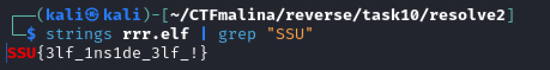
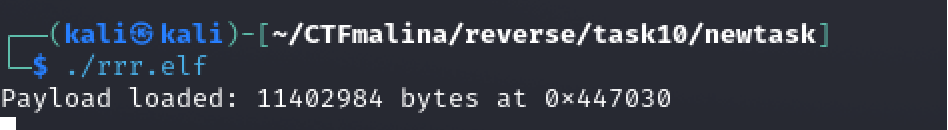
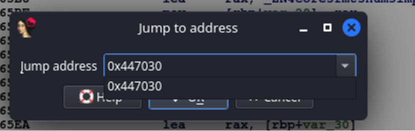
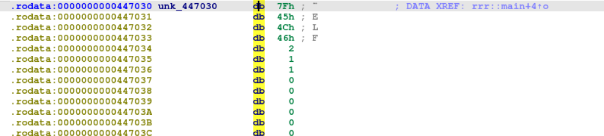
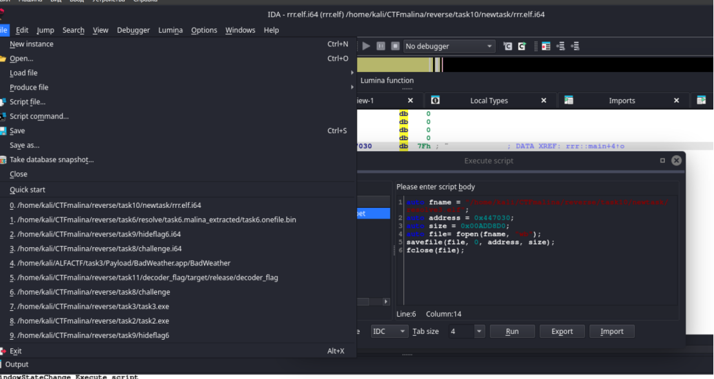
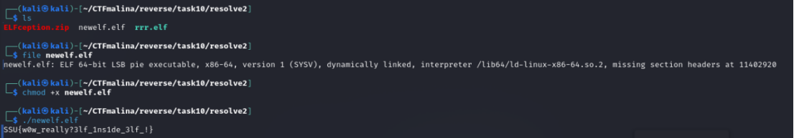

## ELFception [hard]
1100
reverse hard

# Автор: gr8str8some1
# Решил: gr8str8some1

> Описание: С одним эльфом вы уже сталкивались. Но что делать, если их больше? (кроме того, что убегать)

# Решение:
Пройдёмся по строкам.<br>


Но, рано радоваться :D<br>
Флаг не подойдёт...<br>

Запускаем, и смотрим, что нас ждёт.<br>
Но нас ждут не новые "загадки", а наоборот какие-то подсказки.<br>


Для того, кто ничего не понял, поясняю....<br>
Пейлоад (полезная нагрузка) загружен: кол-во бит по адресу<br>
Зайдем в IDA, и через go перейдем к этому адресу (горячая клавиша G)<br>


Перейдя на этот адрес, нас встречает сигнатура ELF-файла.


~~Бежим~~Извлекаем:<br>
Но как извлечь этот elf?<br>
Честно говоря, вариантов сдампить уйма.<br>
Все разбирать не вижу смысла, покажу вариант работы непосредственно с IDA: <br>
File > script command <br>
И там пишем скрипт.<br>
Автор позаботился, поэтому не надо вычислять ни адрес, ни размер. Это всё было сообщено ещё в начале)<br>


Запускаем скрипт<br>
```bash
auto fname = "/home/kali/CTFmalina/reverse/task10/resolve2/newelf.elf";
auto address = 0x447030;
auto size = 0x00ADD8D0;
auto file= fopen(fname, "wb");
savefile(file, 0, address, size);
fclose(file);
```

Ну и после отработки (обязательно смотрим в консоль IDA на наличие ошибок) в указанный путь сдампится elf новый, который можно будет запустить, сделав его исполняемым<br>

