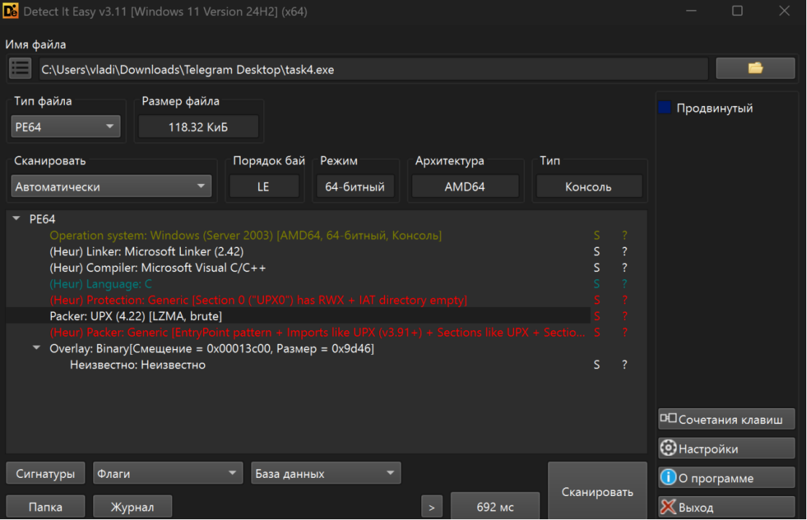
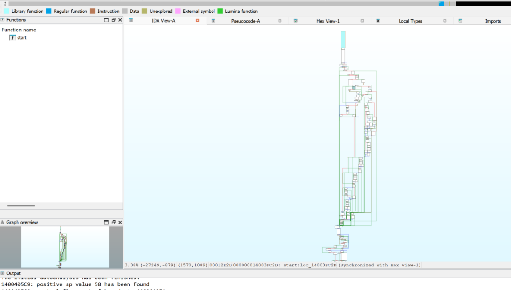
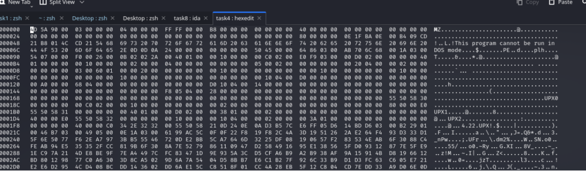
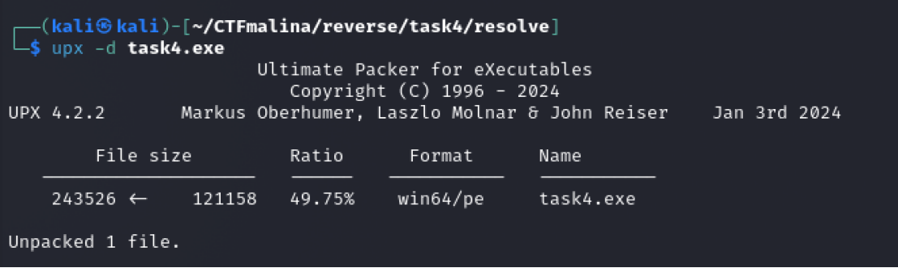
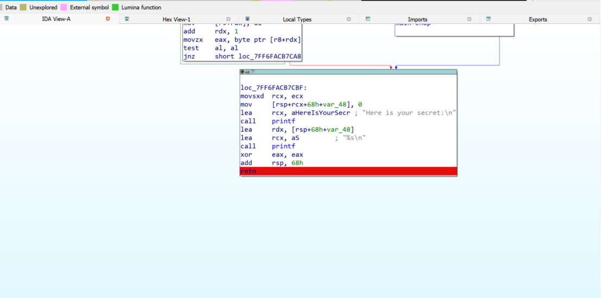
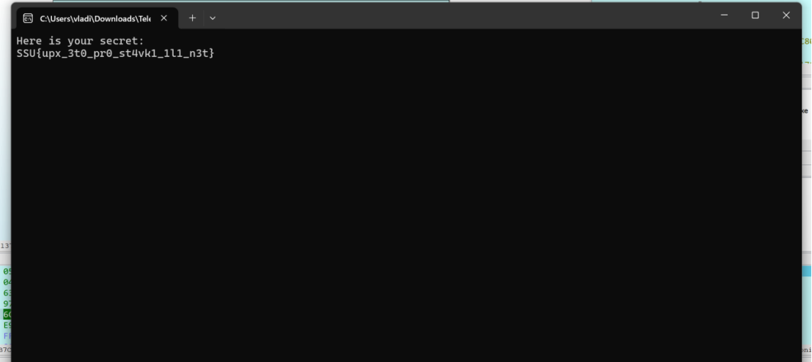

## Apchi! [easy]
350
reverse easy

# Автор: gr8str8some1
# Решил: gr8str8some1

> Описание: 
 \- UPXchi! 
 \- Будьте здоровы!". 
  Кто-то явно простудился, запаковывая этот файл. 

# Решение:
Воспользуемся программой DIE (detect it easy) 

Видим, что есть упаковщик UPX. 
Пробуем засунуть в IDA, посмотрим, что нас ждёт 

Судя по графическому представлению, большое количество разветвлений, трудно анализируемая логика, и куча обфускации 
Есть несколько способов решить данную проблему: 

**Способ 1** 

Посмотрим сигнатуру файла через hexedit 

Как мы видим, помимо "UPX1, UPX2.." есть и "UPX!". Вот эту штуку можно поломать любым изощрённым способом, и всё будет ок 

**Способ 2** 

Второй же способ - воспользоваться "распаковщиком" 

После чего, достанется распакованный exe-шник. Его уже можно запускать 
Запустив, у нас открывается консоль и сразу же закрывается. 
Что-то здесь не ладно... Зайдем в IDA и поставим брейкпоинт (F2) на последнем return перед завершением программы, чтобы словить "конечное" состояние. 

Смотрим, что получилось: 
