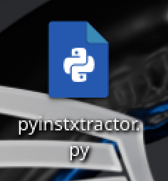
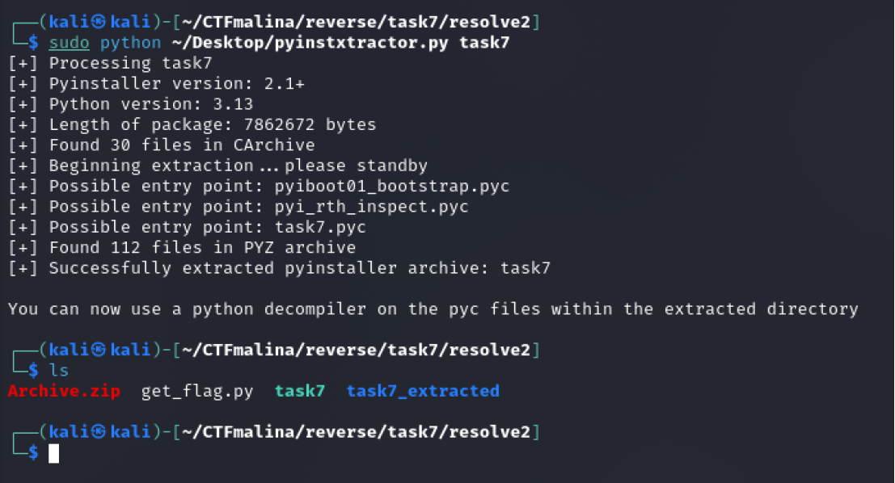
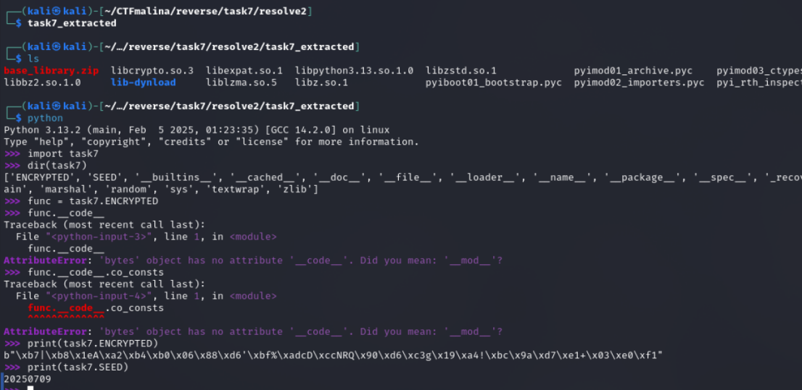
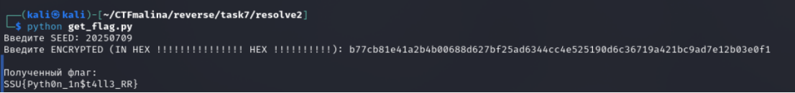

# Installer or Extractor? [medium]
600
reverse medium

### Автор: gr8str8some1
### Решил: gr8str8some1

> Описание: PythonInstaller? Поясню: нам попал в руки подозрительный установщик. На первый взгляд — обычный Python-скрипт, запакованный в инсталлятор. Но что-то здесь не так. Он больше похож на экстрактор... или, может быть, наоборот? Ваша задача — разобраться в хитросплетениях этого двойного агента и найти спрятанный флаг.<br>

### Решение:
Разорхивировываем, получаем два файла. Один из них требует SEED и ENCRYPTED<br>
Нужно найти репозиторий в опенсорсе с экстрактером для PyInstaller<br>


Его же можно будет потом запустить на наш второй файл, который появился вместе с get_flag.py<br>


После запуска, появляется папка, куда экстрактор всё вытащил<br>
Зайдём в неё и посмотрим, что в ней.<br>


Теперь, самое интересное: работа с Pyc.<br>
Гуглим, что это за тип файла, и как с ним работать.<br>
Но, вообще говоря, есть очень хорошие утилиты, например: decompyle3, uncompyle6, Decompyle++, и куча-куча других.<br>
А ещё, есть такая интересная штука, как dll-injecting.<br>
> [!IMPORTANT]
> Следует учитывать и тот факт, что все работает не для каждой версии питона. Руководство как всегда очень простое:<br>
> Гуглим, что такое .pyc, а потом, как его крякнуть и перебираем все способы из открытых источников. Есть также статьи в интернете на эти темы.

Однако, в данном случае, версия питона одна из новейших, ввиду чего вот это всё вряд ли поможет (хотя я и не проверял)<br>
Для таких особых случаев существует REPL-инспекция<br>
Инфа вкратце:<br>
```bash
__code__ — это атрибут функции в Python, который содержит объект типа code object (скомпилированный байткод и его метаданные). С ним удобно инспектировать, что именно выполняет функция, не запуская её.
Ключевые поля func.__code__ (одни из полезнейших):
co_consts — кортеж литералов, встречающихся в функции (строки, числа, вложенные code-объекты и т.д.). Именно тут вы увидели строку-флаг.

co_names — имена, к которым делает обращения байткод (импортированные функции/переменные).

co_varnames — локальные переменные и параметры.

co_code — сам байткод (bytes).

co_filename, co_firstlineno — откуда функция “родом”.

co_flags, co_stacksize, co_nlocals, co_freevars/co_cellvars — служебка для VM.
```

Вернёмся к решению:<br>


Пояснения:<br>
Допустим, нам ещё трудно отличить функции от "не функций", поэтому просто перебором тыкаемся во всё, что можем.<br>
Однако, во всё тыкаться в данном случае необязательно, ведь нам изначально требовались seed и encrypted, и мы их тут прям и видим, просто осталось понять, как их вытащить<br>
И, в конце-то концов, просто пробобуем их запринтить :)<br>

После чего, полученные артефакты засовываем во вторую программу и забираем флаг<br>
