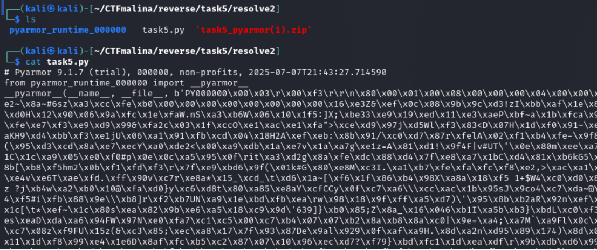
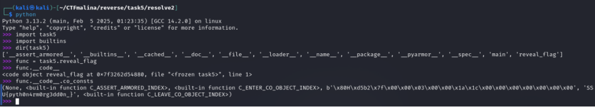

## PyArmorgeddon [medium]
650
reverse medium

### Автор: gr8str8some1
### Решил: gr8str8some1

> Описание: Python + Armor = PyArmor.
Эта задача — не просто реверс Python-кода. Перед вами — укреплённый бастион, возведённый с использованием PyArmor. Вам предстоит не только понять логику работы программы, но и преодолеть многоуровневую защиту, созданную этим мощным обфускатором. Сможете ли вы пробить эту броню и раскрыть секрет, который она скрывает?

# Решение:
Распаковываем, смотрим, что внутри. 

Ну и огорчаемся, потому что всё обфусцированно. 
И работаем точь-в-точь по предыдущему райтапу (7 таска). .
Я посчитал, что использовать любой decoder pyc будет "в одну строчку" и "легко", REPL-инспекция даёт поболее.
Так что, чекаем reveal_flag и забираем флаг 

