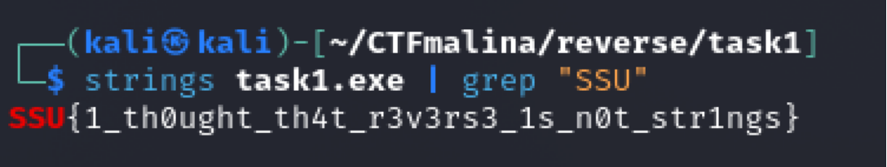

## Light weight [easy]
200
reverse easy

# Автор: gr8str8some1
# Решил: gr8str8some1

> Описание: Вы знали, что реверс, — это не всегда дизассемблирование?

##Решение:
Воспользоваться утилитой strings и посмотреть строки. Флаг зашит напрямую.

