# Debugging Paradox [hard]
1200
reverse hard

### Автор: gr8str8some1
### Решил: gr8str8some1

> Описание: Это приложение живёт своей двойной жизнью: без отладчика оно бурчит «где дебаг?», а под дебагом — «я вас вижу!» Флаг же гибнет между этими мирами. Точнее, в мире дебага 🙂 
Смельчакам и шутникам — на удачу!

### Решение:
Разорхивировываем, смотрим, что нас ждёт: 
Проверяем строки. Пусто. 
Что ж, запускаемся: 
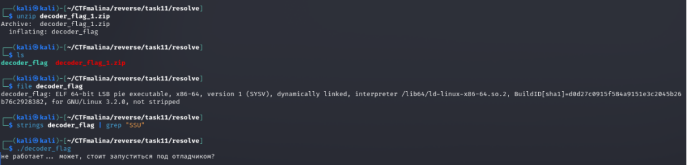

Нас просит запуститься под отладчиком... 
Но как **оно** поняло... 

Следуем совету 
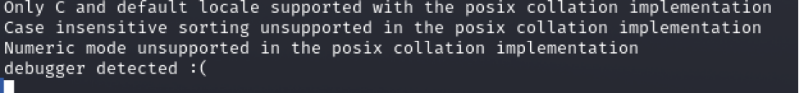

О нет... **оно** слишком умное и поняло, что мы под отладчиком. 
И что делать? 
А выход есть! 

У нас есть артефакты. Один из них "debugger detected" 
Именно он потому, что мы будем в будущем работать под отладкой. "Обычка" нас не особо в целом интересует 
Что ж, так же, как и в прошлых тасках, ищем эту строку (ctrl+f) и ставим на ней брейкпоинт (F2). 
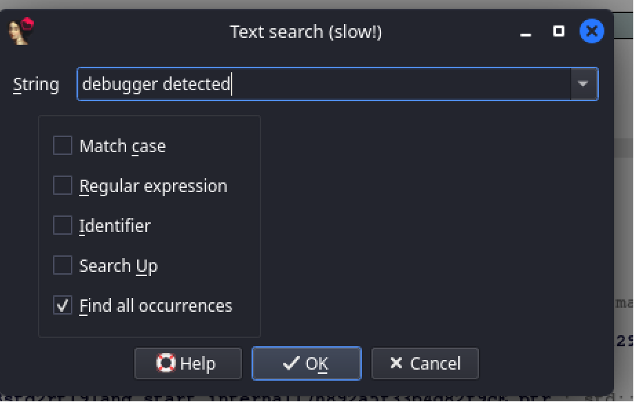

Даблклик 
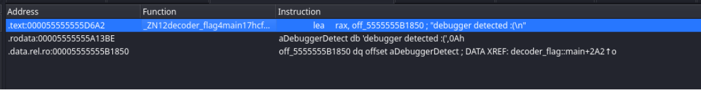

Но! Тут мы ставим брейкпоинт, в отличие от предыдущих задач, на конструкции условного/безусловного перехода:
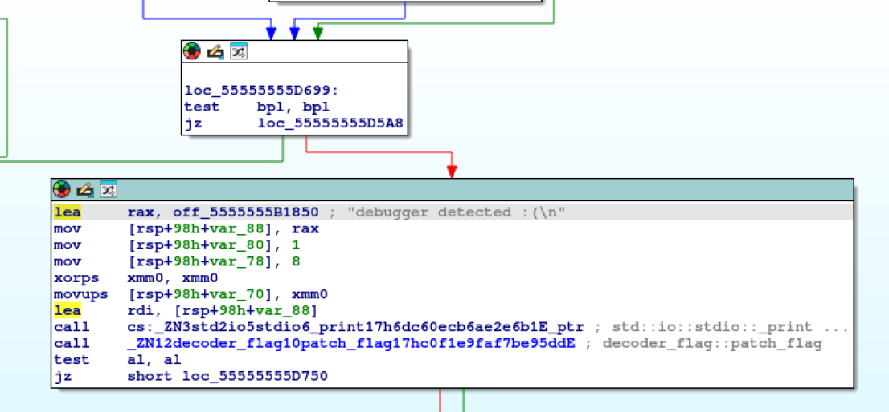

В основы конструкций ассемблера погружаемся самостоятельно)) 
Запускаемся снова, и мы должны будем остановиться на брейкпоинте 
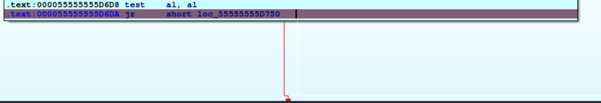

В ходе отладки, у нас мигают "стрелочки-ветки", которые показывают, куда мы должны перейти.  
И иногда, в зависимости от программы и настроек IDA, если менять программу (патчить), мигание может переходить "динамически" без перезапуска программы сразу на другие ветки. 
Но это не суть.  
Главное, что в данном случае у нас мигает правая ветка и это значит, что мы перейдём туда. Если чуть-чуть проанализировать, что там, то будет ясно, что это всё уйдёт в заверешение программы  
(Ну в целом это было и так понятно) 
Ввиду чего, надо сделать как-то так, чтобы программа считала, что мы ввели всё верно на этапах выше и "прыгнули в нужную ветку" 

Тут логика чуть легче, и прям в левой сразу будет видно, что это "декодер флага". 
Именно туда-то нам и надо попасть 

Теперь о том, как это сделать: 

Вариант 1: 
Вот так выглядит левая ветка. Тут прям по комментарию понятно, что декодер, да. 
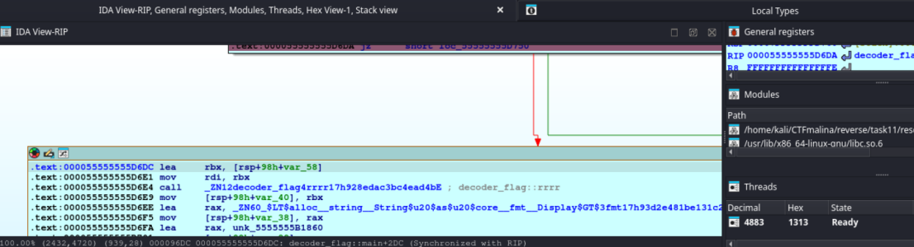

И вот справа в General Registers есть RIP. 
Опять же, регистры гуглим сами, ровно как и их назначение)) 
Вкратце, он отвечает за адресацию 
Поэтому, в него можем засунуть адрес начала этого "левого блока" и после продолжения выполнения программы мы паройдёмся именно по той ветке. 
Адрес, если что, вот этот: 
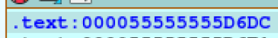

Вариант 2 (мой любимый): 
Патчинг! 

Задача: пропатчить jz на jnz. 
Пропатчить - значит изменить. 
Ну а второе - просто по логике. Раз одно нас пускало в одну ветку, другое направит в другую, следовательно нужную нам 
Для этого: 
- Выделяем jz 
- Нажимаем edit > patch program > и, самое удобное, assemble (правда, чаще меняют именно биты. но это тоже надо сделать грамотно, чтобы не поломать программу. ну и знать какие биты за какие конструкции отвечают, например 0x90 = NOP (этим удаляют)) 
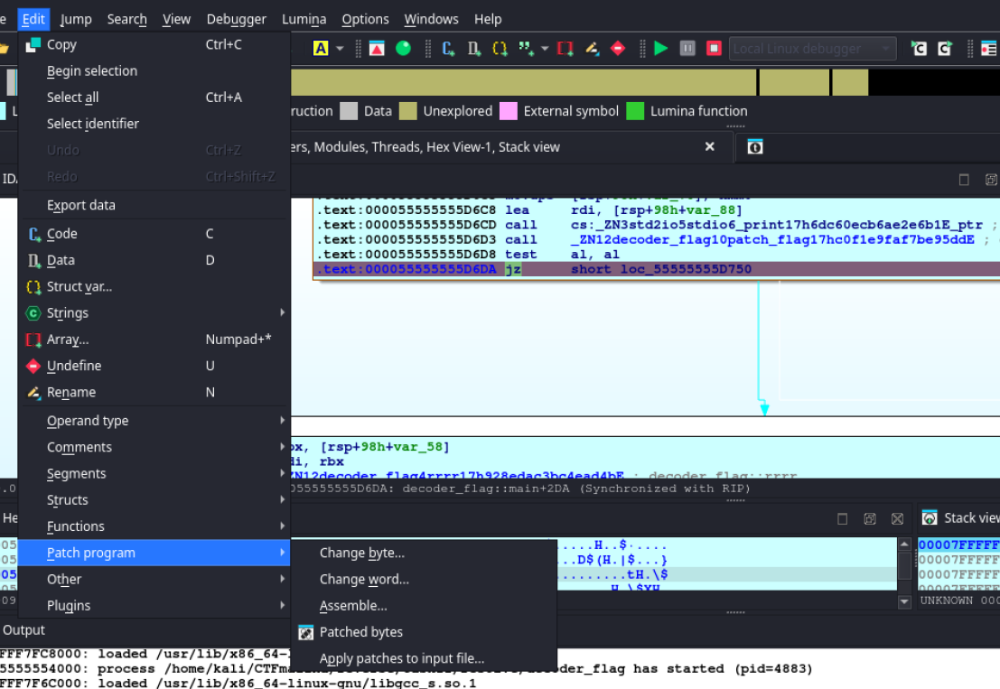
- Меняем jz на jnz
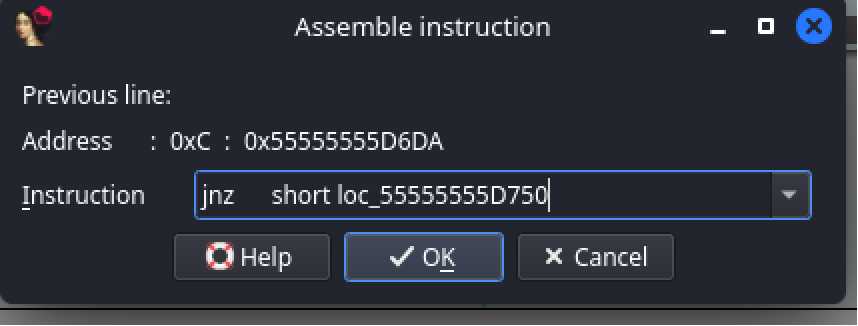
- Теперь заново edit > patch program
- apply changes!
> [!WARNING] Смотрим, чтоб старт-конец были или весь файл, или нужный блок.
- И нажимаем ок, то бишь принимаем изменения. 
- Можем изменить хоть в тот же файл, хоть в новый. Лучше, конечно, в новый, чтобы не сломать "боевой". Но если и уверены, можем в тот же фигачить. Я так и сделал, т.к. понимаю, что делаю, и понимаю, что быстренько смогу патчнуть обратно в случае чего. 

Т.к. панк, фигачу в тот же:  
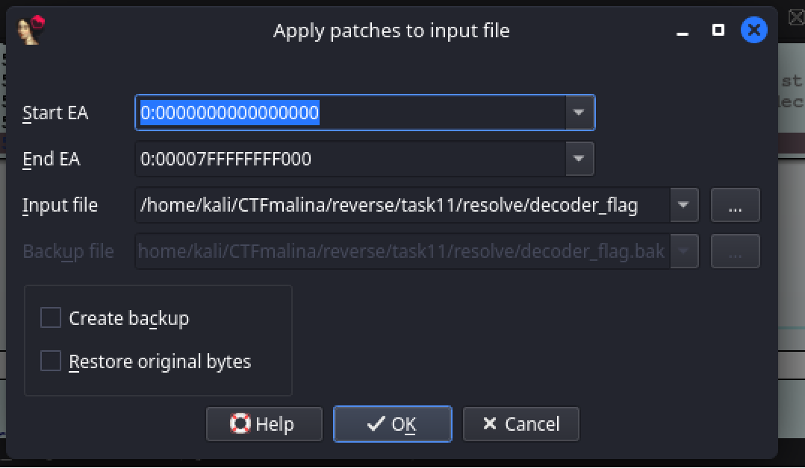

Обязательно проверяем в консоли иды, что всё успешно! 
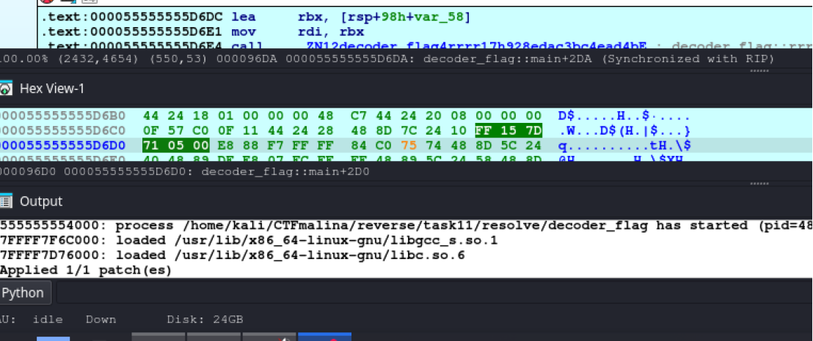

В нашем случае применился 1 из 1 патча.  

Ну так вот. При любом из способов, мы окажемся в блоке, где надо. (брейкпоинт поставил чисто чтобы показать, что мы сюда вошли) 
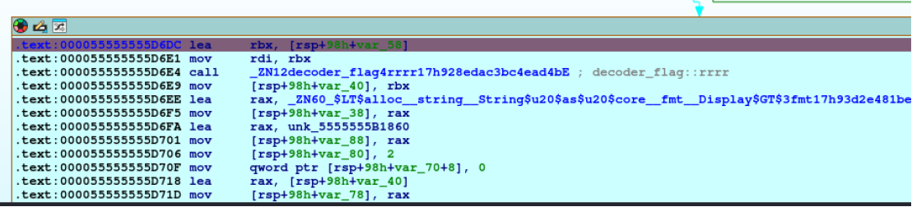

Ну а так как это "та самая ветка, которая нам нужна", программа пройдет до конца так, как будто бы мы ввели верные данные на этапах ранее, ибо мы, считай, "перескочили", все проверки, изменив программу под себя. 

А вот и итог программы: 
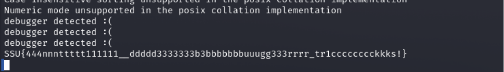