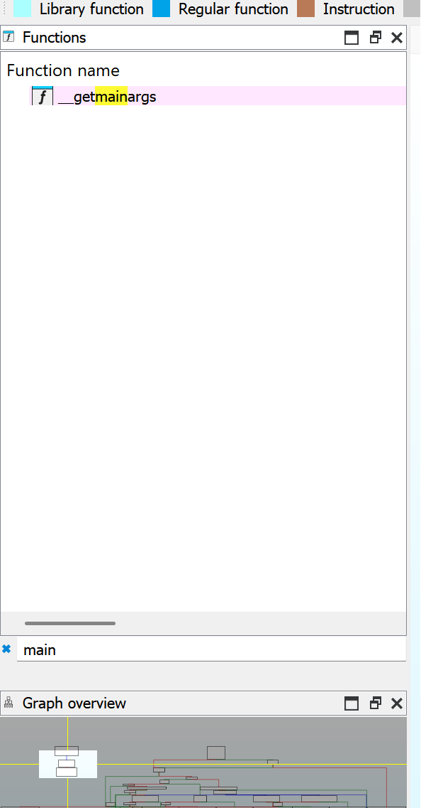
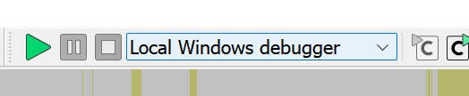
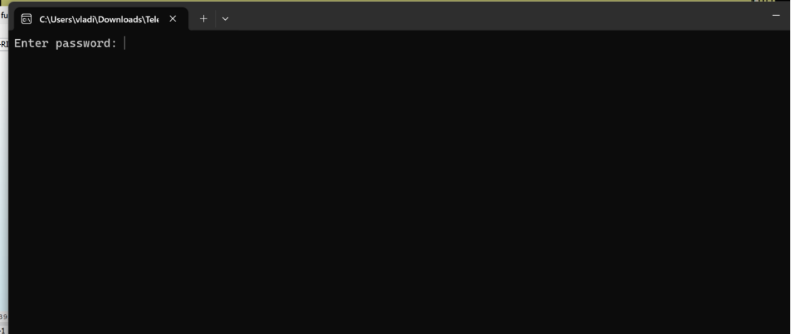
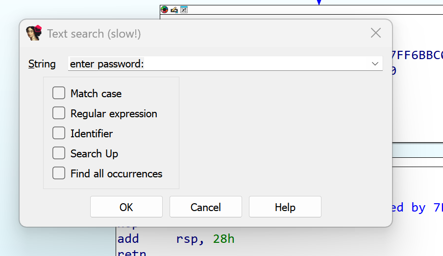
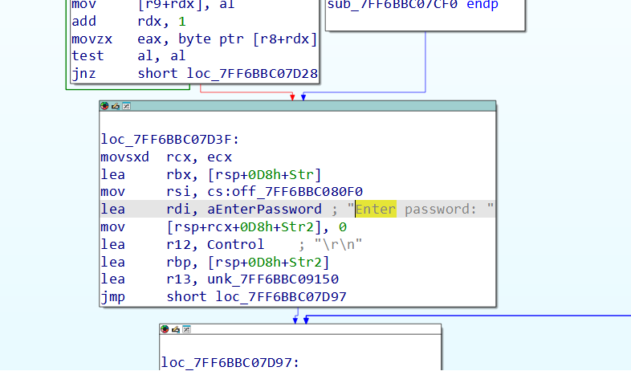
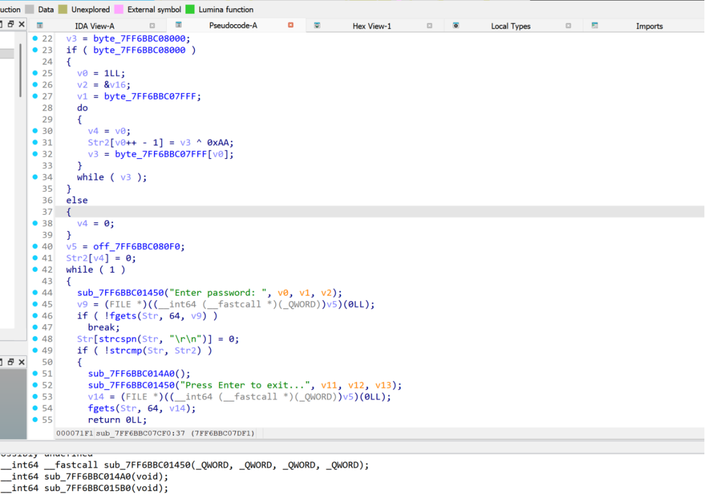

# Not light weight [easy]
250
reverse easy

## Автор: gr8str8some1
## Решил: gr8str8some1

> Описание: Грустно, но ревёрс — иногда и дизассемблирование

## Решение:
Открываем в IDA, пробуем найти функцию main по имени (вообще говоря есть куча способов определять именно точку входа, но мы пройдемся именно по базе)<br>


Запустим в отладчике, выбрав тут локальный дебаггер


Открывается консоль и просит пароль. Так-то всё ещё ничего не понятно, но теперь у нас есть за что зацепиться в поиске этого всего дизассемблера, а именно за строку «Enter Password»


P.S. Нужно понимать, что декомпилирование - это представление кода в человекочитаемом виде, в то время как дизассемблирование - представление машинных инструкций на языке асемблер. И между этими решимами можно переключаться в IDA, так же как и в дизассемблированном виде между графическим видом, и обычным. Горячие клавиши - tab и пробел.
Так вот, т.к. у нас есть зацепка на строку, сочетанием клавиш ctrl+f попробуем найти эту строку


Такое действительно нашлось. Значит, мы уже понимаем, где мы находимся хотя бы чисто визуально. Перейдем в декомпилированный формат


Тут описана вся логика шифрования. Но также, тут есть и таблицы, по ним можно переходить, два раза щёлкнув. Например, byte_SMTH. Примеры «этого byte» и «кода» будут ниже, чтобы было понимание.


```bash
__int64 sub_7FF6BBC07CF0()
{
__int64 v0; // rdx
char *v1; // r8
char *v2; // r9
char v3; // al
int v4; // ecx
__int64 (__fastcall *v5)(); // rsi
__int64 v6; // rdx
__int64 v7; // r8
__int64 v8; // r9
FILE *v9; // rax
__int64 v11; // rdx
__int64 v12; // r8
__int64 v13; // r9
FILE *v14; // rax
char Str[63]; // [rsp+20h] [rbp-B8h] BYREF
char v16; // [rsp+5Fh] [rbp-79h] BYREF
char Str2[120]; // [rsp+60h] [rbp-78h] BYREF

sub_7FF6BBC015B0();
v3 = byte_7FF6BBC08000;
if ( byte_7FF6BBC08000 )
{
v0 = 1LL;
v2 = &v16;
v1 = byte_7FF6BBC07FFF;
do
{
v4 = v0;
Str2[v0++ - 1] = v3 ^ 0xAA;
v3 = byte_7FF6BBC07FFF[v0];
}
while ( v3 );
}
else
{
v4 = 0;
}
v5 = off_7FF6BBC080F0;
Str2[v4] = 0;
while ( 1 )
{
sub_7FF6BBC01450("Enter password: ", v0, v1, v2);
v9 = (FILE *)((__int64 (__fastcall *)(_QWORD))v5)(0LL);
if ( !fgets(Str, 64, v9) )
break;
Str[strcspn(Str, "\r\n")] = 0;
if ( !strcmp(Str, Str2) )
{
sub_7FF6BBC014A0();
sub_7FF6BBC01450("Press Enter to exit...", v11, v12, v13);
v14 = (FILE *)((__int64 (__fastcall *)(_QWORD))v5)(0LL);
fgets(Str, 64, v14);
return 0LL;
}
sub_7FF6BBC01450(&unk_7FF6BBC09150, v6, v7, v8);
}
return 0LL;
}
```

```bash
byte_7FF6BBC08000 db 0F9h               ; DATA XREF: sub_7FF6BBC07CF0+14↑r
.data:00007FF6BBC08001                 db 0F9h
.data:00007FF6BBC08002                 db 0FFh
.data:00007FF6BBC08003                 db 0D1h
.data:00007FF6BBC08004                 db 0DFh
.data:00007FF6BBC08005                 db 0C4h
.data:00007FF6BBC08006                 db 0CCh
.data:00007FF6BBC08007                 db  9Ah
.data:00007FF6BBC08008                 db 0D8h
.data:00007FF6BBC08009                 db 0DEh
.data:00007FF6BBC0800A                 db 0DFh
.data:00007FF6BBC0800B                 db 0C4h
.data:00007FF6BBC0800C                 db  9Eh
.data:00007FF6BBC0800D                 db 0DEh
.data:00007FF6BBC0800E                 db  99h
.data:00007FF6BBC0800F                 db 0C6h
.data:00007FF6BBC08010                 db 0D3h
.data:00007FF6BBC08011                 db 0F5h
.data:00007FF6BBC08012                 db 0D8h
.data:00007FF6BBC08013                 db  99h
.data:00007FF6BBC08014                 db 0DCh
.data:00007FF6BBC08015                 db  99h
.data:00007FF6BBC08016                 db 0D8h
.data:00007FF6BBC08017                 db 0D9h
.data:00007FF6BBC08018                 db  99h
.data:00007FF6BBC08019                 db 0F5h
.data:00007FF6BBC0801A                 db  9Bh
.data:00007FF6BBC0801B                 db 0D9h
.data:00007FF6BBC0801C                 db 0F5h
.data:00007FF6BBC0801D                 db 0C4h
.data:00007FF6BBC0801E                 db  9Ah
.data:00007FF6BBC0801F                 db 0DEh
.data:00007FF6BBC08020                 db 0F5h
.data:00007FF6BBC08021                 db 0D9h
.data:00007FF6BBC08022                 db 0DEh
.data:00007FF6BBC08023                 db 0D8h
.data:00007FF6BBC08024                 db  9Bh
.data:00007FF6BBC08025                 db 0C4h
.data:00007FF6BBC08026                 db 0CDh
.data:00007FF6BBC08027                 db 0D9h
.data:00007FF6BBC08028                 db 0D7h
.data:00007FF6BBC08029                 db    0
```

```bash
byte_7FF6BBC07FFF db 0                  ; DATA XREF: sub_7FF6BBC07CF0+2D↑o
```
```bash
ff_7FF6BBC080F0 dq offset sub_7FF6BBC07640
```

Что происходит?
В коде берётся байтовый массив byte_7FF6BBC08000 и посимвольно ксорится с константой 0xAA, результат кладётся в Str2. Это видно по строке вида Str2[i] = byte ^ 0xAA;.
Далее введённая строка сравнивается с Str2 через strcmp. Значит «правильный пароль» - это просто массив, раскодированный XOR’ом с 0xAA.
Прогоняем массив байтов
F9 F9 FF D1 DF C4 CC 9A D8 DE DF C4 9E DE 99 C6 D3 F5 D8 99 DC 99 D8 D9 99 F5 9B D9 F5 C4 9A DE F5 D9 DE D8 9B C4 CD D9 D7 00 через b ^ 0xAA - получаем ASCII-строку:
SSU{unf0rtun4t3ly_r3v3rs3_1s_n0t_str1ngs}
