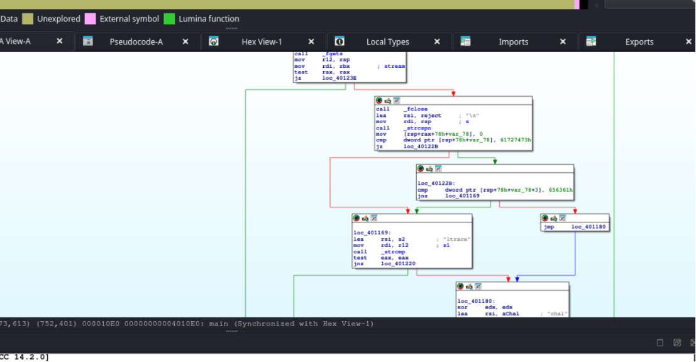
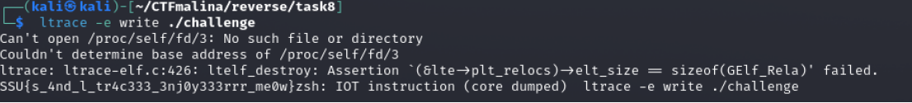
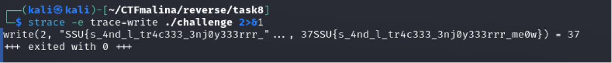

# Ru-Tracer [easy]
250
reverse easy

## Автор: gr8str8some1
## Решил: gr8str8some1

> Описание: Запускается, и ничего...  
Но, кто-то оставил нам следы? Прямо в коде! Этот исполняемый файл относительно молчалив, но внимательное его изучение поможет вам найти спрятанный флаг. Будьте внимательны, ведь даже незначительные детали могут оказаться ключом к разгадке!

## Решение:
Открываем прогу и сразу видно комментарии с подсказками 

ltrace, strace комментариями оставлены.  
гуглим, изучаем, после чего пробиваем либо первым способом  

либо вторым

