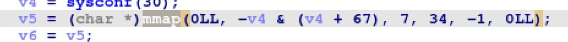
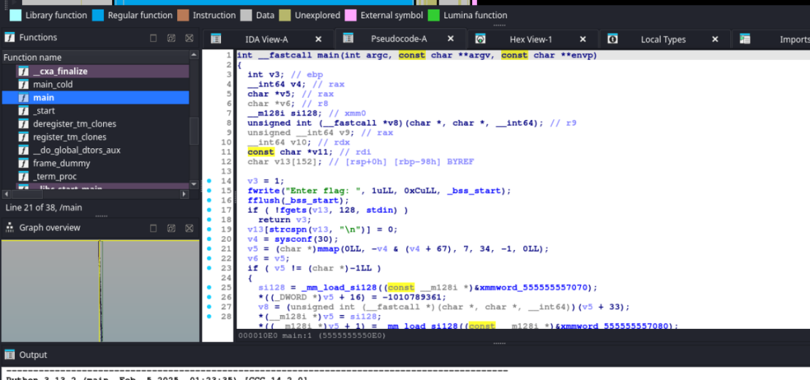
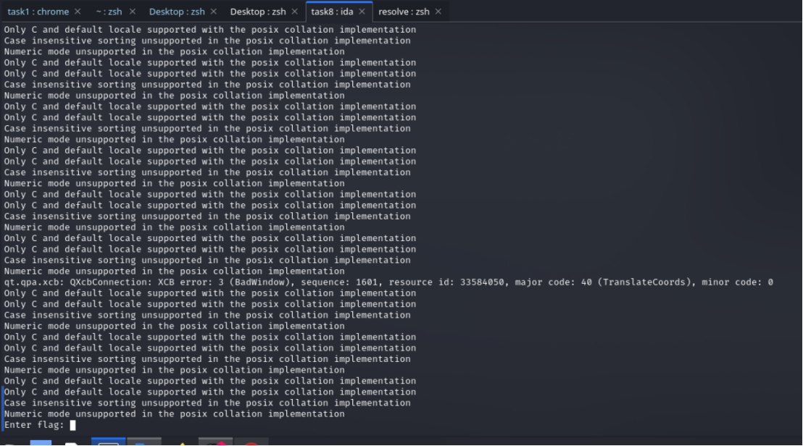
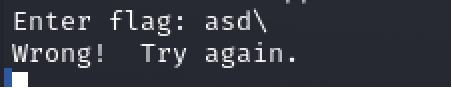
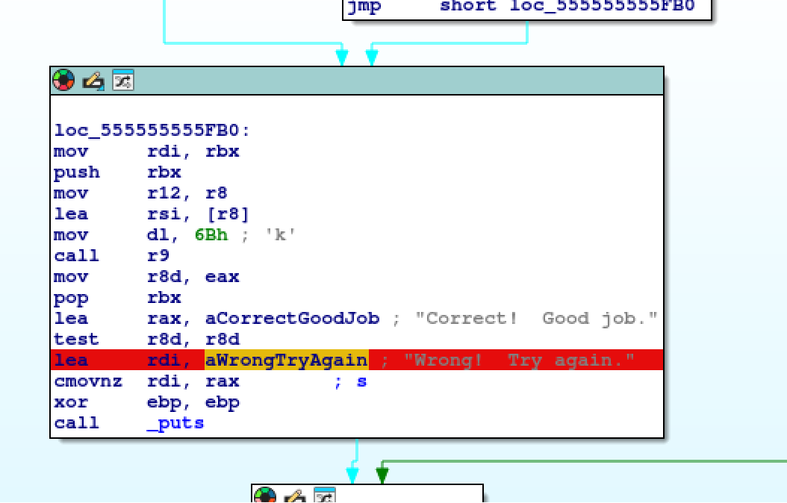
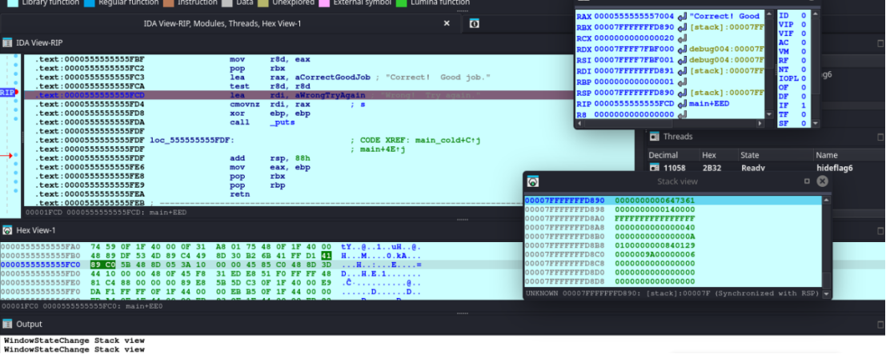
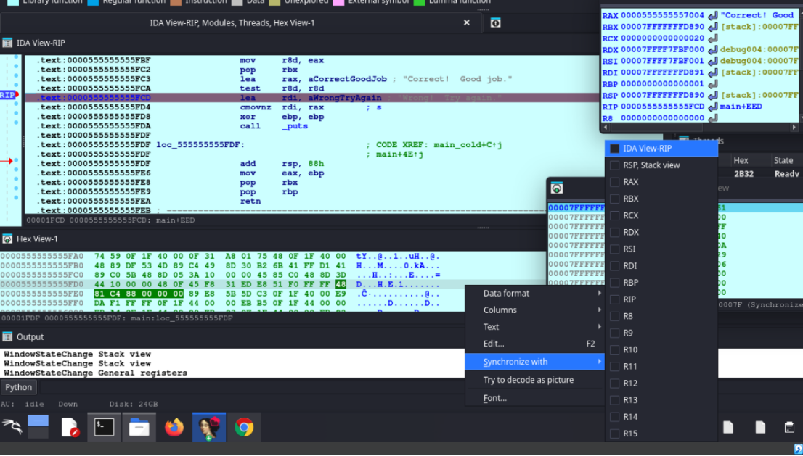
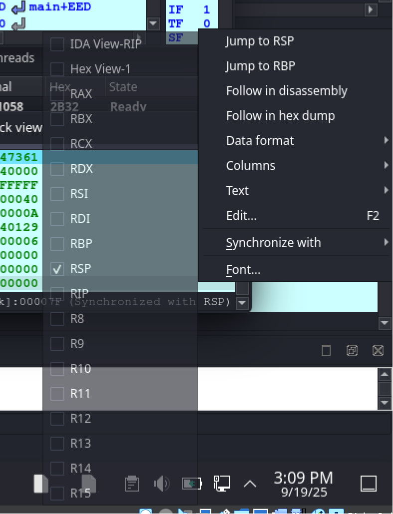
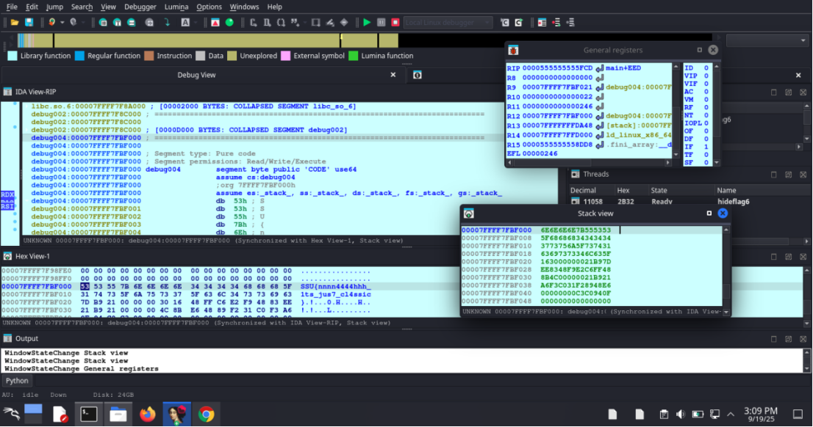

## Hidden (почти) [medium]
450
reverse medium

# Автор: gr8str8some1
# Решил: gr8str8some1

> Описание: Этот исполняемый файл скрывает свой секрет, и он не появится на экране по волшебству. Похоже, что ключ к разгадке лежит глубже, чем кажется на первый взгляд... 
(может, недостаточно смотреть только на вывод программы?...) 

# Решение:
> [!TIP] Основная зацепка в задаче:
> 

Запускаемся в IDA. В отличие от предыдущих задач, где был exe-шник, тут уже Elf. Этот бинарь уже под unix. 
А значит, и IDA нам нужна на линуксе. (Либо на винде оставляем, но тогда нужен будет remote linux debugger подключить к линуксу по гайдам от нейронки/интернету, чтобы работать в отладке эльфа на винде) 
Открыв, можем найти функцию main слева так же по поиску ctrl+f (нужно заранее нажать на какую-то функцию, чтобы поиск был именно среди функций, а не по строкам например в дизассемблере/всей проге) 

Т.к. мы работаем в линухе, у нас ввод будет осуществляться консольно, а ждать этот вод будет ida в том же месте, откуда мы и запускали иду. 
Запустили локальную отладку на линуксе и посмотрим, может программа чего-то от нас требует, чтобы найти "точку", от которой можно оттолкнуться, по сути своего рода артефакт. 

Да, так и есть, ожидается ввод флага. 

Но, нам этого мало, поэтому введём что-нибудь, чтобы уйти в ветку "неверно указан флаг" 

Таки действительно, такая надпись есть и вот уже два артефакта. 
Поищем, где именно в программе находится строка с "Wrong флаг" 

> [!TIP] Дружеское напоминание:
> Ctrl+f -> вписываем -> дальше везде шмалаем на энтеры.
> Таб/пробел - переключение между графовым представлением/дизассемблером/декомпилятором
> F2 - брейкпоинт

Ставим брейкпоинт на строку с Wrong Флаг. 

Заново запускаем заново вводим что угодно 
И теперь мы остановились на брейкпоинте 

Теперь нужно синхронизовать hex-view, stack-view c нашим IDA View RIP 
Тыкаем по пустому месту в Stack view 

И по аналогии по пустому месту в Hex view 

И везде надо поставить галочку IDA View RIP, во всех окошках, чтобы всё синхронизировать. 
Это нужно для того, чтобы когда мы листали наш дизассемблер, вместе с ним листался и стек, и hex, чтобы сразу видеть, не упускаем ли мы что-то 

Дальше нажимаем на r12 в регистрах (на стрелочку) 

И, т.к. мы синхронизировали везде окна, в hex view можно будет увидеть флаг.