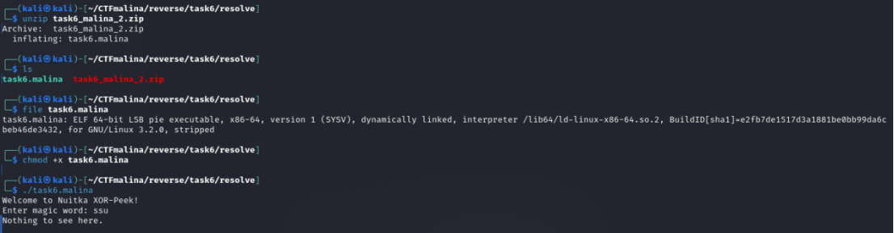
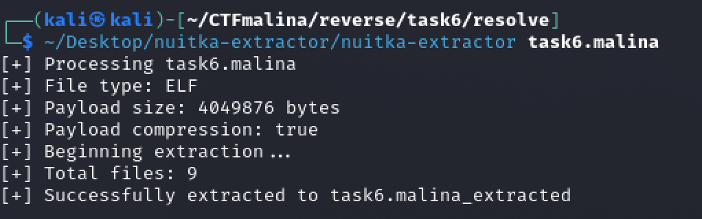
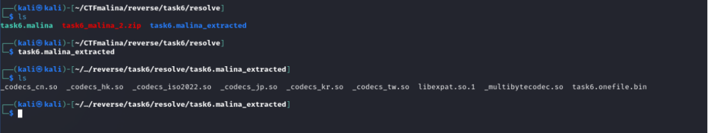
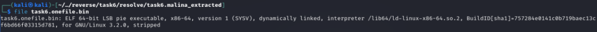
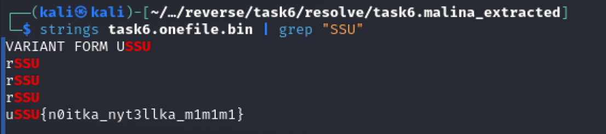

## Nytellka [medium]
750
reverse medium

# Автор: gr8str8some1
# Решил: gr8str8some1

> Описание: Любите сладкое? А как насчёт Nuitka? Ой, Nytellka! Ведь кто-то решил ускорить свой Python-код, но оставил небольшой сладкий сюрприз. Сможете ли вы раскрыть секреты и добраться до начинки?

# Решение:
Смотрим, с чем имеем дело: 

Это эльф, всё стандартно. Сделаем файл исполняемым и запускаем.  
Нас просят ввести некий "magic word" 
Находим в опенсорсе nuitka extractor. 

И с помощью него прогоняем наш файлик. 

И посмотрим, что у нас получилось в итоге: 

Видим папку с extracted, в ней есть бинарь, посмотрим, что это конкретно: 

Это эльф. Делаем его исполняемым и запускаем. 

Ого! А мы такое уже видели. Пробуем просто вывести строки, как самое первое вообще в принципе действие 

