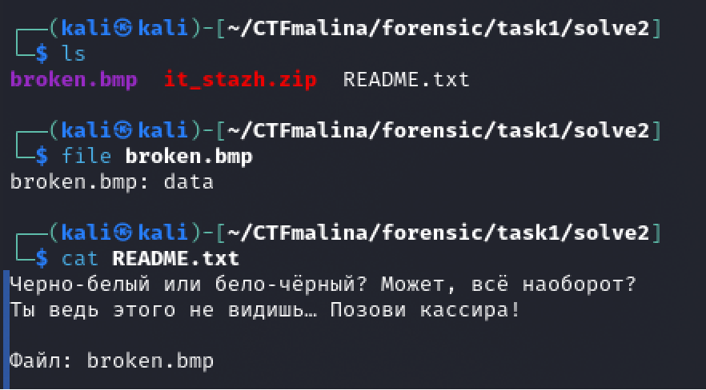
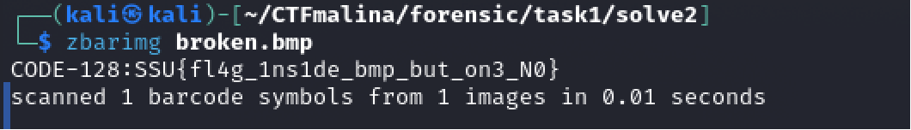

# Magic Bytes [easy]
200
forensic easy

### Автор: gr8str8some1
### Решил: gr8str8some1

> Описание: IT-стажёр: Magic Bytes! 
В IT-компанию устроился новый сотрудник. Но он какой-то странный. Кто его принял? Постоянно что-то бормочет себе под нос, ведёт себя неадекватно. Из интереса чекнули резюме, но из него понять ничего не удалось; ток фотка забавная: у него прича штрихкод и огромные клоунские ботинки

### Решение:
Разорхивировали. 
Смотрим, что за файл 
Плюс, прочитаем ридми. 

Странно, почему-то пишет дата, хотя у нас bmp. 
Давайте проверим сигнатуру файла. 

Так и получается, что сигнатура битая. 
Меняем на верную (ZZ -> BM | 42 4D)  
Все сигнатуры (magic bytes) можно найти в интернете, для каждого формата файла  

Проверяем, что за файл после того, как починили. 

Теперь-то всё хорошо. 
Давайте его откроем. 

Прогоняем через zbarimg, либо по какому-нибудь любому ридеру в интернете, например https://products.aspose.app/barcode/recognize . 

