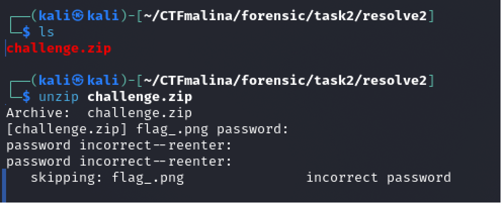
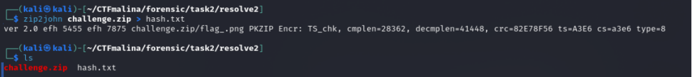
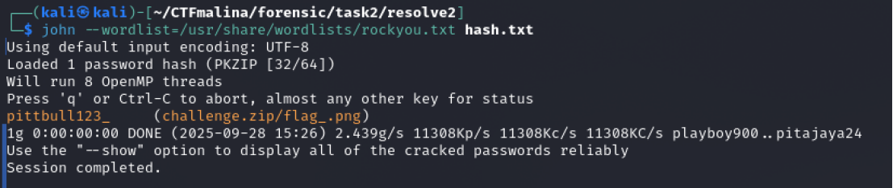
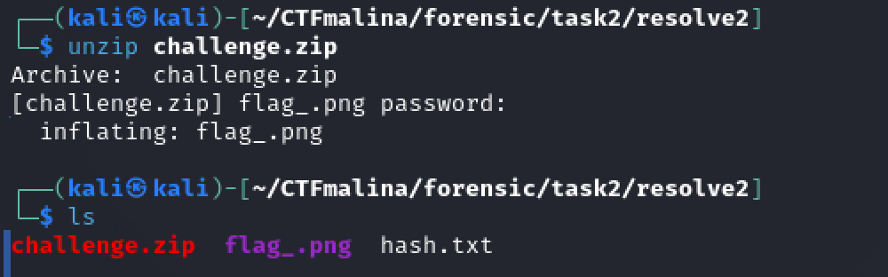
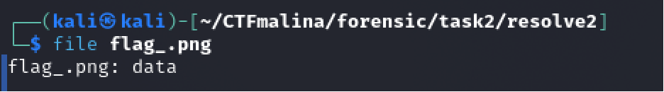
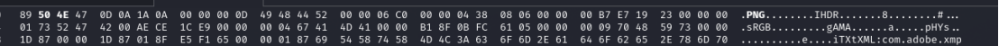

## RockMe [easy]
200
forensic easy

# Автор: gr8str8some1
# Решил: gr8str8some1

> Описание: Открывай архив, и посмотри флаг в картинке!)

# Решение:
Разорхивируем: 

Только не всё так просто... **Оно** требует пароль. 
Но и мы не пальцем деланы! 
Получаем хэш и прогоняем через любой подходящий брутер. 

Вордлисты, по которым будем брутить, можно скачать в интернете. Их уйма 
В кали есть стандартный rockyou. Да и в целом это такой "на дурачка", базовый список. 
Запускаем и проверим, найдёт ли пароль 

Таки-нашло. pittbull123_ 
Давайте теперь его введём 

Извлёкся png 

Однако, он так же не открывается(( 
А всё потому, что опять битый. 
Проверим, с каким файлом вообще имеем дело 

Так и есть, это data, а не PNG. 
Фиксим magic bytes (42 4D меняем на 50 4E). 
Опять же, список всех сигнатур и Magic bytes есть в интернете, знать наизусть никто не знает)) 

Фиксим! 

И открываем) 
