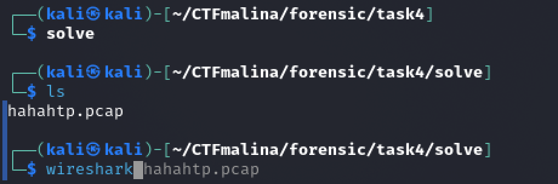
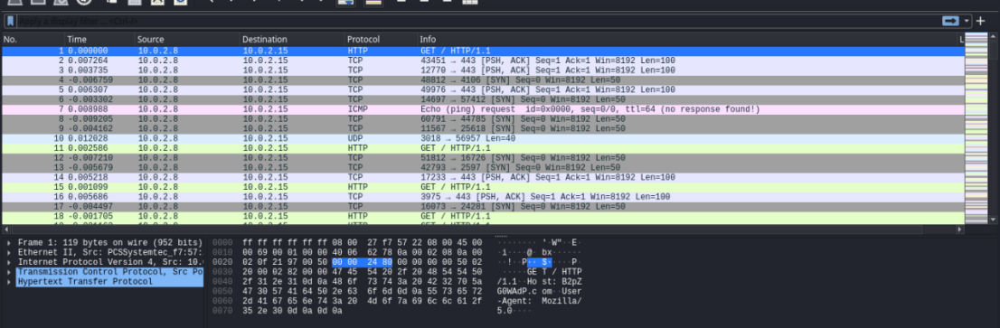
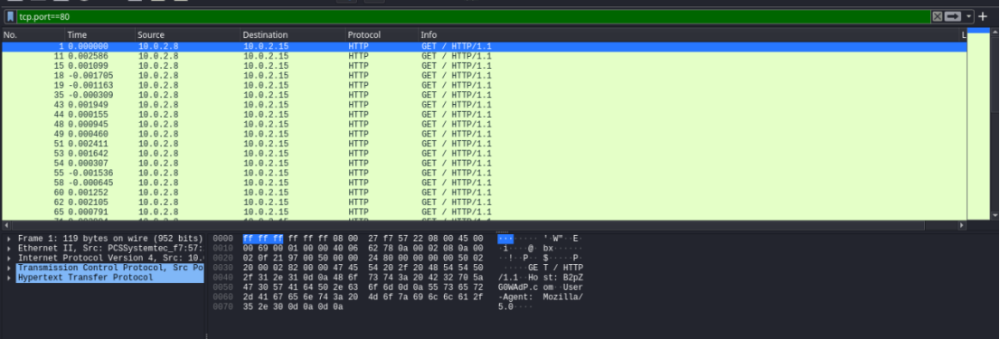
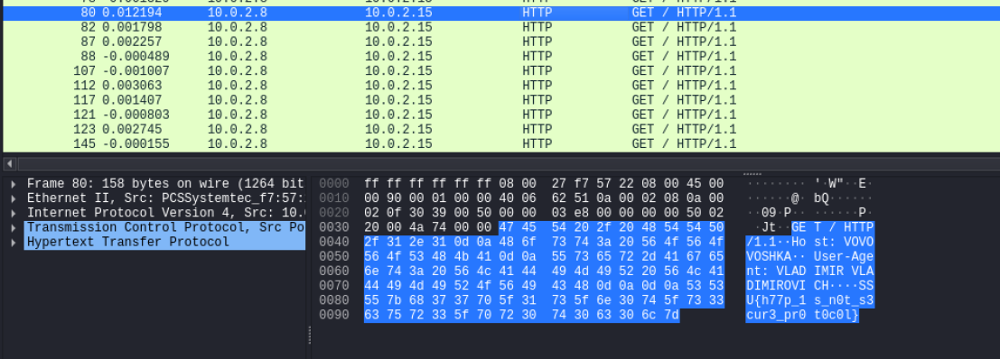

## Hahahttp [easy]
200
forensic easy

# Автор: gr8str8some1
# Решил: gr8str8some1

> Описание: Слышали что-нибудь про 80 порт? А он о вас? 
Формат флага: Host_SSU{...} 
*Host можно увидеть в нужном пакете с флагом 

# Решение:
Запускаем этот pcap в wireshark 

Фильтруем пакеты по 80 порту: 
> [!TIP] 
> Самые базовые и полезные:
> 21 ftp
> 22 ssh
> 23 telnet
> 25 smtp
> 80 http
> 443 https
> 3389 rdp

В одном из них есть и флаг, и хост (Host: VOVOVOSHKA). 
Формируем ответ 
