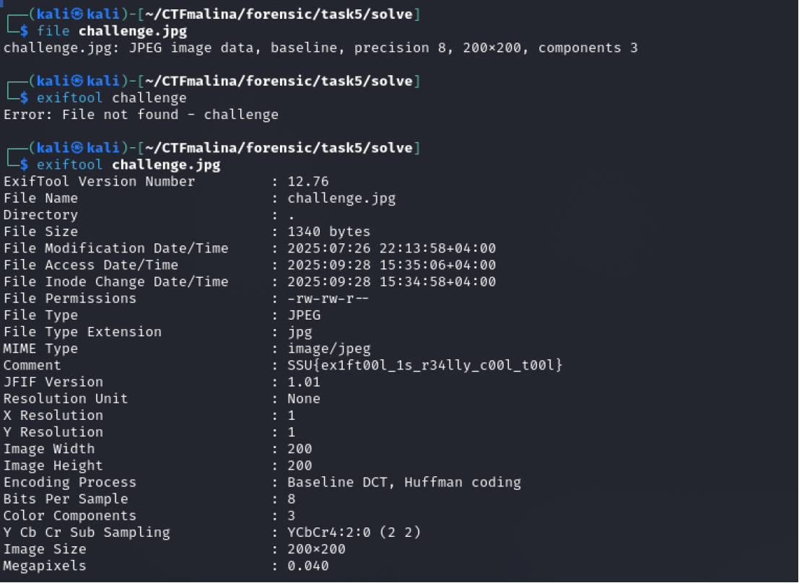

## JPG (camera) [easy]
200
forensic easy

# Автор: gr8str8some1
# Решил: gr8str8some1

> Описание: Открой картинку и получи флаг x2

# Решение:
Проверяем, что за файл 
После чего, воспользуемся утилитой exiftool 
