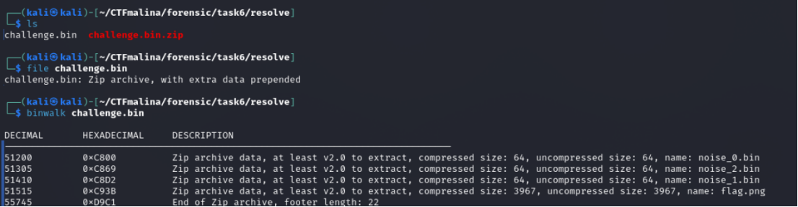
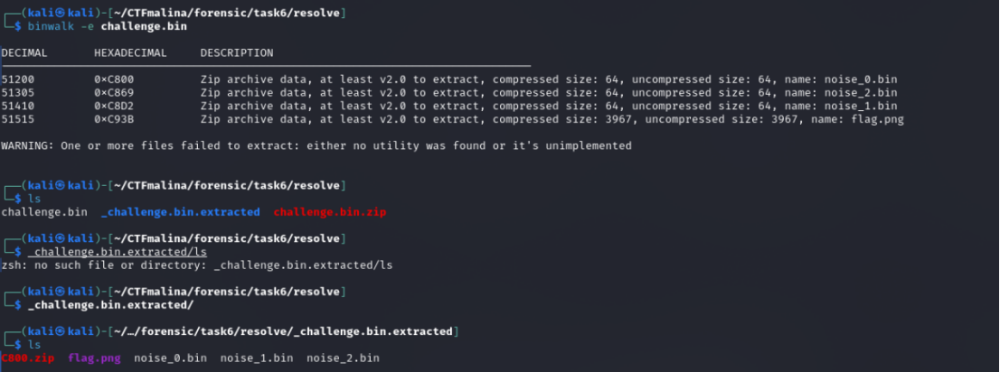

# Walk это не волк walk это ходить [easy]
200
forensic easy

### Автор: gr8str8some1
### Решил: gr8str8some1

> Описание: Бинарь есть. Задание есть. И причем тут волк?

### Решение:
Проверяем, что перед нами: 

Zip? У нас же .bin написано... 

Можно, конечно, и попытаться разорхивировать. 
Но таска предусматривает следующие действия: 

Работа с бинволком) 
После извлечения у нас появится папка с extracted 
А в ней некий png, который можно открыть 

