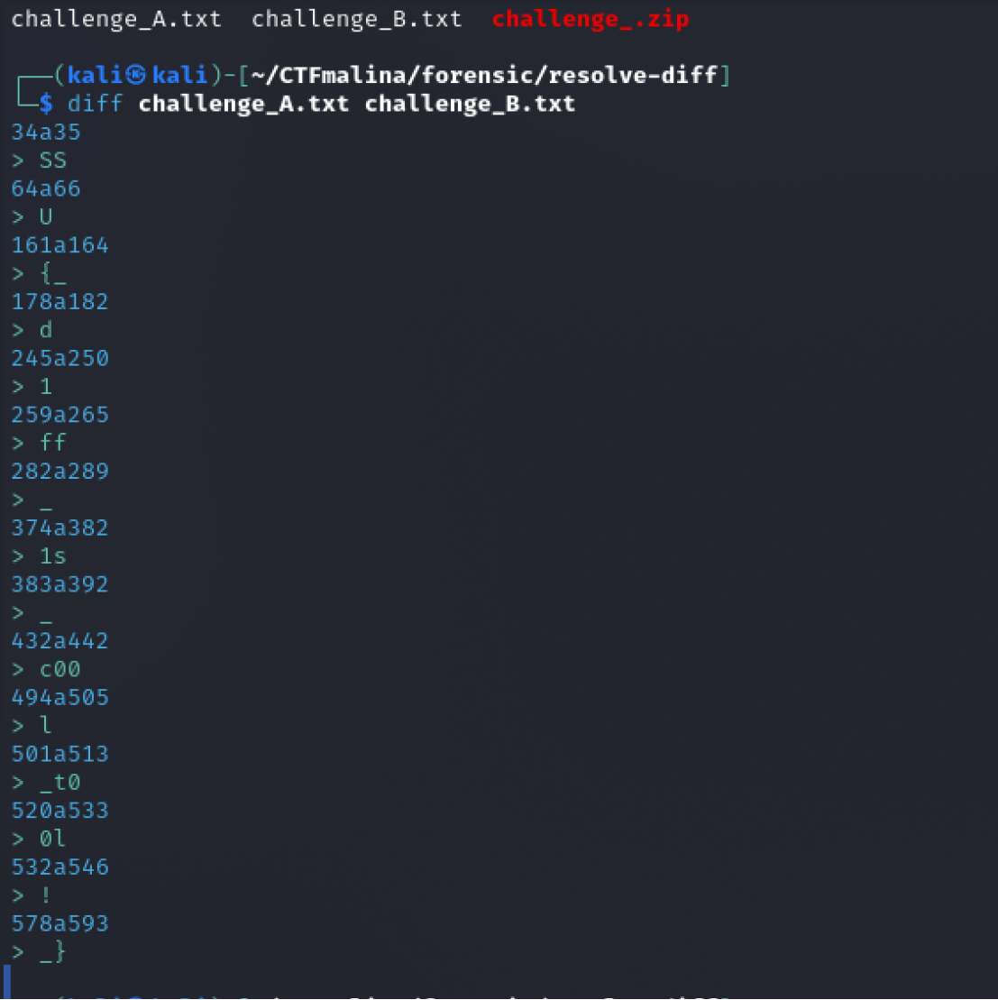

## А тебе какая разница? [easy]
200
forensic easy

# Автор: gr8str8some1
# Решил: gr8str8some1

> Описание: Хочешь спросить почему дано два файла? Да просто так. Бери любой и не задавай вопросов. Как говорится, «А тебе какая разница»!

# Решение:
Есть два файла. 
Воспользуемся утилитой diff(erence) 
