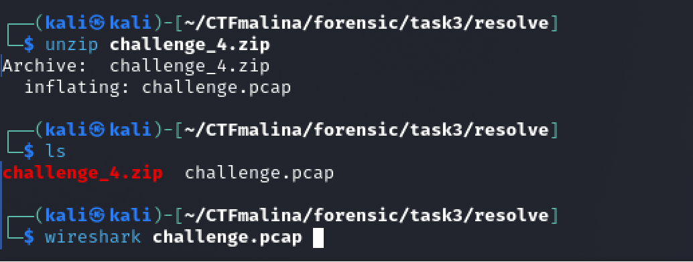
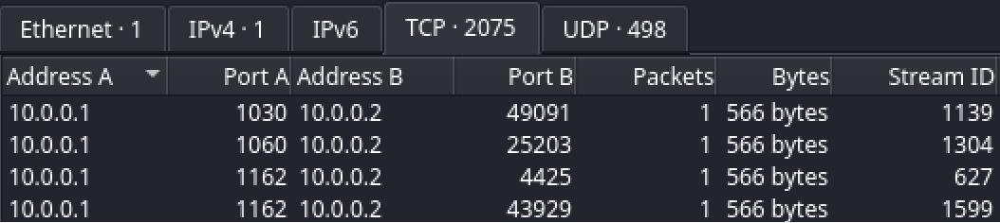
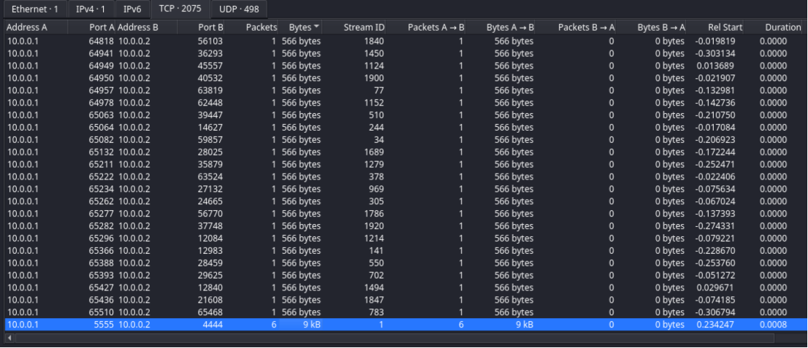
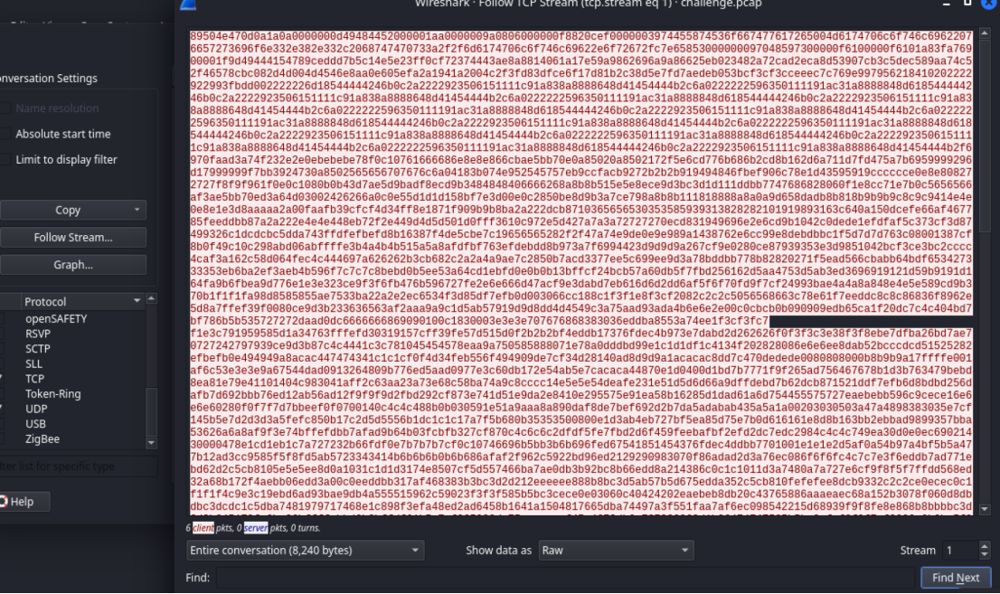

# Phantom Streams [medium]
550
forensic medium

### Автор: gr8str8some1
### Решил: gr8str8some1

> Описание: Отделом реагирования на инциденты было зафиксировано аномально большой объем смешанного сетевого трафика между двумя узлами. Проанализируйте TCP-streams: может, в одном из них есть что-то важное

### Решение:
Запускаем в wireshark 

Заходим в Statistics > Conversations 
Переключаемся на tcp и смотрим все соединения 

И вот один из потоков с портом 4444 прям выделяется по bytes на фоне остальных. 

Нажимаем на follow слева 
И получаем вот такую ерунду. 

Сохраняем как Raw, жмём save и указываем имя файла. Я указал test 
Смотрим, что сохранилось: 
