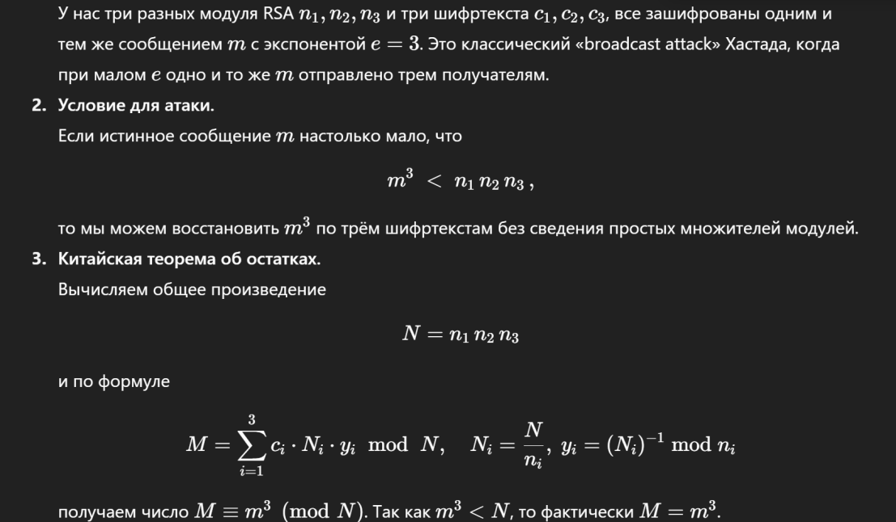

# Кристалл эха 2 [easy]
200
crypto easy

### Автор: gr8str8some1
### Решил: gr8str8some1

> Описание: В этом же подземелье был найден ещё один кристалл, но: каждая впускает в себя один и тот же невидимый звон, однако тройное усиление их граней превращает его в неразборчивый шёпот. Отправьтесь к трем призматическим зеркалам, чтобы выловить каждый из трёх отрывков шёпота. Сведите эти шёпоты в единую гармонию — и лишь тогда древний резонанс обнажит истинную мелодию.<br>
n1 = 0xbcd80099d4be1bbce176490926b9a2b4fe1a3330a6b8dcc2960a4e9c720378cbca84096d6d438c44632ee1632568a38ca5c0a523871b8bba59581eba19fb800d<br>
c1 = 0x6ee524f4b1873f9c009f113a0d376361aaa7eedfd15209355f4c8f9d4386a1be8f5a449ea0e29490e4727224518bf756acb79f0d707ce0599f8da867b9df9abb<br>
n2 = 0xd1e8c3d1b114c2325abde280b04fe43dd7d243a961ae2498d823f99c2ca8aa9a1b29945e4e2bb8a91bebea9f5dba3430d01d84cc65e6bb9e38cea868fcc4e307<br>
c2 = 0xcae5d251cfb28dcebb8aeeeb39c00af7fc5c51178401da5dd1c2c553ab38ca6c6e57f13d79f0be68b2be8fc2c9586b03839f1e565526a267821528f021015d82<br>
n3 = 0xb3eaec4d45adc7241c4dcbb9a67166c230db631de892f63fe7ad72c05d5177e9c19b8fefe2087e48188d4da1119597854d278d2277e55d265821c2717057a895<br>
c3 = 0xf9893619562efe83c7ed11f2a5d6c83a0f9a3acba78e599dd09f8da747ca6bd8a96360b80aae03562d6598c14d195d1761aabb111bc414a5fe9952f1dc57da4<br>
e = 3

### Решение:

```bash
Атака Hastad Broadcast:
один и тот же текст нескольким адресатам + малый публичный ключ + нет надёжного padding
(в отличие от атаки "small e" тут длина m может быть любой)
n1 = 0xbcd80099d4be1bbce176490926b9a2b4fe1a3330a6b8dcc2960a4e9c720378cbca84096d6d438c44632ee1632568a38ca5c0a523871b8bba59581eba19fb800d
c1 = 0x6ee524f4b1873f9c009f113a0d376361aaa7eedfd15209355f4c8f9d4386a1be8f5a449ea0e29490e4727224518bf756acb79f0d707ce0599f8da867b9df9abb
n2 = 0xd1e8c3d1b114c2325abde280b04fe43dd7d243a961ae2498d823f99c2ca8aa9a1b29945e4e2bb8a91bebea9f5dba3430d01d84cc65e6bb9e38cea868fcc4e307
c2 = 0xcae5d251cfb28dcebb8aeeeb39c00af7fc5c51178401da5dd1c2c553ab38ca6c6e57f13d79f0be68b2be8fc2c9586b03839f1e565526a267821528f021015d82
n3 = 0xb3eaec4d45adc7241c4dcbb9a67166c230db631de892f63fe7ad72c05d5177e9c19b8fefe2087e48188d4da1119597854d278d2277e55d265821c2717057a895
c3 = 0xf9893619562efe83c7ed11f2a5d6c83a0f9a3acba78e599dd09f8da747ca6bd8a96360b80aae03562d6598c14d195d1761aabb111bc414a5fe9952f1dc57da4
e = 3
```

Китайская теорема от остатках + извлечение корня<br>

Более подробное описание от умняша:<br>


SSU{1ts_n0t_RS4_1ts_h4st4d_br04dc4st}