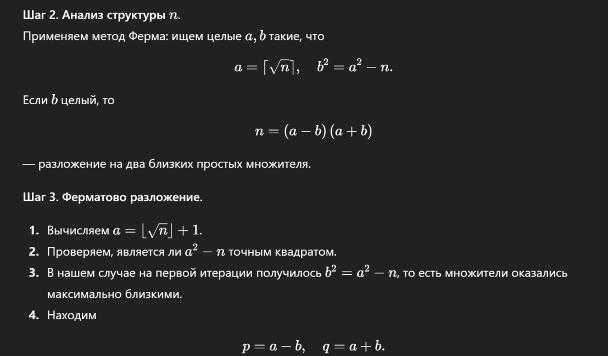
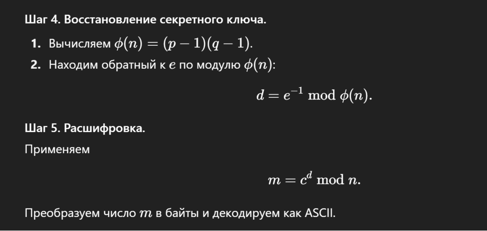

# Дуэт равновесия [easy]
200
crypto easy

### Автор: gr8str8some1
### Решил: gr8str8some1

>Описание: Выйдя из подземелья, вы наткнулись на глубины руин. Внутри стоит монолит, разделённый невидимой трещиной: две почти идентичные половины укрывают старинное послание. Лишь оценив малейший дисбаланс и уравновесив его древним методом вычитания граней, вы раскроете тайны камня.<br>
n = 0xed8c3aa9686d488174277eee38ce6b6bcdb9f5e1ecbb27efd2656cb55ef7a2e1d0901c9f3e13793def7308e73cb40913b8c7c11b979ba5ab2e6346f36735ba7a53b5f6c433591e65959e25b639cecba02f251c1eae2d210d88cf6f740294d53c26fe4368381fc5e0b20dd7b6695076a4b7158d75f1ddf702aebd0e4bdb4f7eeb<br>
e = 65537<br>
c = 0xe3e7bd24edec44bf30491a50ef9c5fb50c2089c2824929a255d4b7f495f29df917346d96c3ae4fce33fd3882a669db3f93c0a23911b294c43a0ff3dc6d80f092a43e073406ff1b1f9e153ede2320367195918b9ce08d5778ba78c04f39bd89d8daa4e9dae7c1a94bfac7e30ae2b25d3303eaf895a8d81408cc607db3b090019

### Решение:

```bash
Атака Fermat Primes (слишком близкие p и q)
условие: |p-q| < n^(1/4) (практически одинаковые по битовой длине и различаются на сотни-тысячи)
атака: ищем ближайший к sqrt(n) квадрат a^2 пока (a^2 - n) не  танет полным квадратом b^2 тогда: p=a-b, q=a+b
```

n = 0xed8c3aa9686d488174277eee38ce6b6bcdb9f5e1ecbb27efd2656cb55ef7a2e1d0901c9f3e13793def7308e73cb40913b8c7c11b979ba5ab2e6346f36735ba7a53b5f6c433591e65959e25b639cecba02f251c1eae2d210d88cf6f740294d53c26fe4368381fc5e0b20dd7b6695076a4b7158d75f1ddf702aebd0e4bdb4f7eeb<br>
e = 65537<br>
c = 0xe3e7bd24edec44bf30491a50ef9c5fb50c2089c2824929a255d4b7f495f29df917346d96c3ae4fce33fd3882a669db3f93c0a23911b294c43a0ff3dc6d80f092a43e073406ff1b1f9e153ede2320367195918b9ce08d5778ba78c04f39bd89d8daa4e9dae7c1a94bfac7e30ae2b25d3303eaf895a8d81408cc607db3b090019<br>

Более подробные описания от умняша:<br>





SSU{th1s_4tt4ck_n4me_1s_f3rm4t_cl0s3_pr1m3s}
