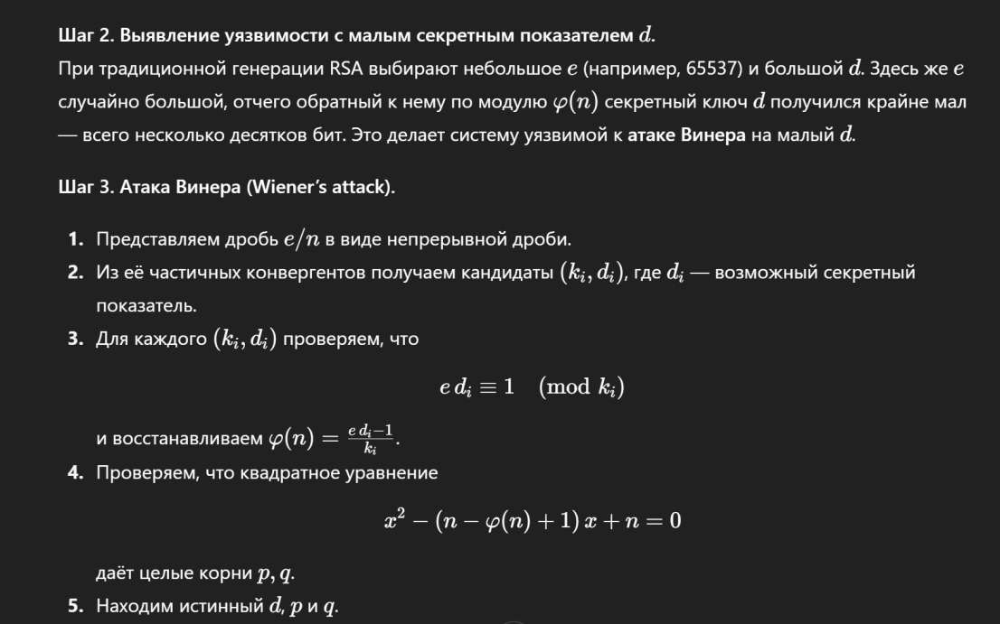
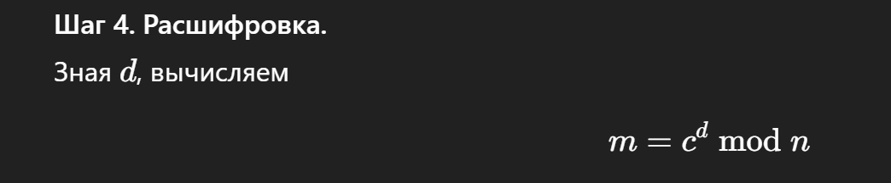

## Танец малых теней [easy]
200
crypto easy

# Автор: gr8str8some1
# Решил: gr8str8some1

>Описание: В глубинах древнего мавзолея мраморная статуя хранителя веками стояла в полной тишине. Но едва рассветный ветер коснулся колонн, и по её рёбрам закружился невидимый танец малых теней — крошечные колебания, слишком тонкие, чтобы их заметили неподготовленные глаза. Как же выловить эти ритмы на границе света и тьмы и собрать их в непрерывную линию?<br>
n = 0xde179ef74144389c4b55c665be97cb0a1272be54bcd2baabc2eed817698ee00abc794668e334b8acadd7acd0f74b4c9f0e32e72337ff9e38e4c4861c0818f2859b59d4cac85c9d3403319ee6b727ef7e9f7b680089a5fee05f3867f05d60daa5aeff5d04873f63f0a89ee59e829cd90c707b9034426966b00f4047219cc96485<br>
e = 0x2b4a070ba761d3632aca22defea2db77717120978ddb2698b75f8b00d25408bce92a89ad5350ec2e15d911a81bd93d2b080f7318781c4c106cc7dbc2d023c47d56ca714646ec7a16e118c70701f34469654a3e0146a8502be5da340cefa1994d9b9e51447609d7999831ce43d8547659dbb8e09491bd9b3471ee1aad419077bf<br>
c = 0x23de721f1024b29cd0dd4f6c7ae0dd8ac8f1d9c9566fbfa3b1edf79324e485dbbb933c42e30b5c4767317cf12f7b0029de152716e8c420b61d7e92ed3f4569ad20f06404951ec8e1c902116ba8f04252d4777763f1ac9e9f40aab557445298477c9c27d7d8f67954b5a97901ca938ddf585b5841e3f8ee4393da68ac3c57bc0d<br>

# Решение:

```bash
атака Wiener (малый приветный d => большой e)
условие: d < 1/3*n^(1/4), e "не слишком мало", q < p < 2q
если d мал, дробь k/d обязательно появляется среди конвергентов цепной дроби e/n

атака: строим цепную дробь e/n перебираем конвергенты (ki, di)
первый где edi ≡ 1 (mod ki) и di < n^(1/4)/3 даёт настоящий d
дальше либо сразу c^d mod n, либо восстановление p,q ч/з квадратное уравнение
```

Более подробные описания от умняша:<br>





SSU{_h1!_1ts_sm4ll_d_4tt4ck_w13n3r}