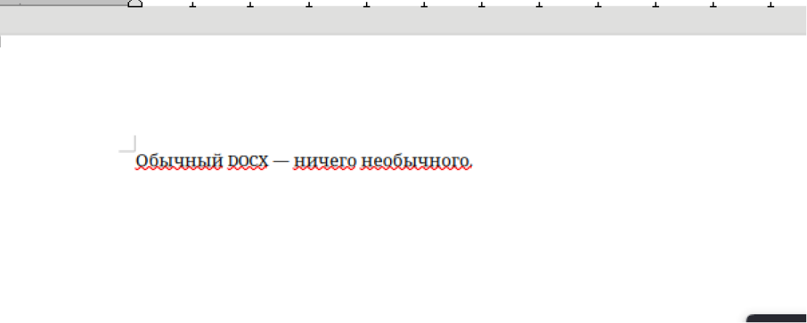
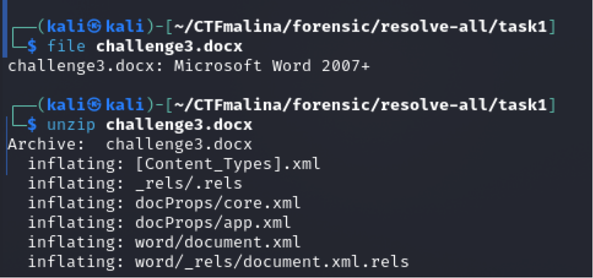
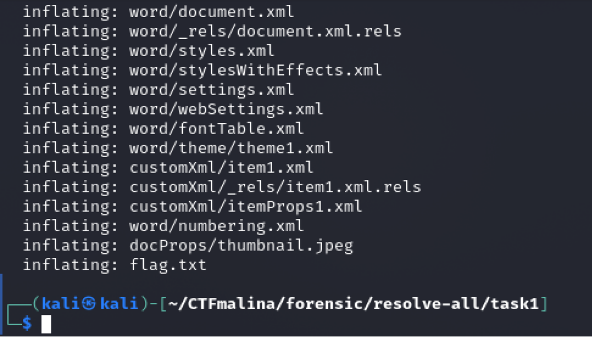
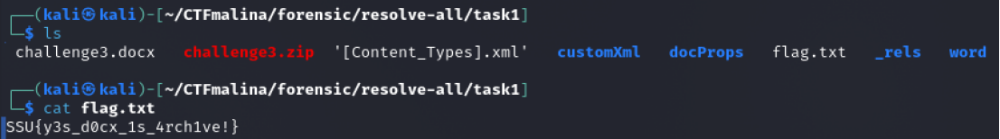

## Шпион в галстуке! [easy]
200
steganography easy

# Автор: gr8str8some1
# Решил: gr8str8some1

> Описание: А если в принципе. То что такое docx?

# Решение:
Открываем: 

Ничего нет... 
Но мы ж не дураки, автору не верим. 
Поэтому, проверяем, а с чем вообще имеем дело 
А затем вспоминаем, что docx это архив)) 
И распаковываем) 

И есть flag.txt 
Читаем) 

