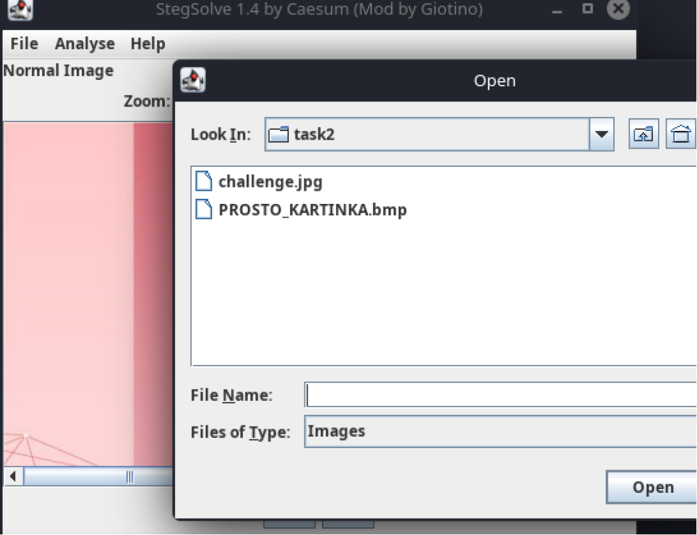

## Deep Blue Cipher [easy]
350
steganography easy

# Автор: gr8str8some1
# Решил: gr8str8some1

> Описание: Sift 
Through 
Every 
Glimmer. 
 
Hidden 
Information 
Demands 
Extraction. 

# Решение:
Во-1, ХВАЛИМ АВТОРА за описание таски. 
Во-2, если там ещё и собрать заглавные, то получим один из инструменов решения, а точнее steghide. 

Смотрим, что в архиве: 

Запускаем Steghide 

Просит пароль :(  
Качаем из опенсорса stegsolve 

Открываем одну из картинок, проверяем её: 

Сдедлаем зум меньше: 

Везде неразбериха, по типу такой: 

Эта неразбериха выявляется путём "листания по стрелочкам", тем самым мы прошлись по всем каналам. 
Но у нас есть и вторая картинка. Пробуем и её. 
В blue plane 0 

Что-то есть, приближаем 

И вставляем пароль в passphrase 

