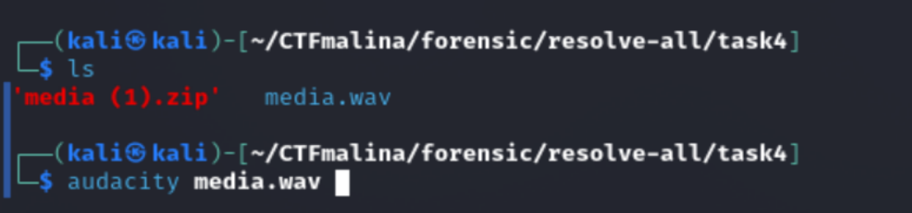
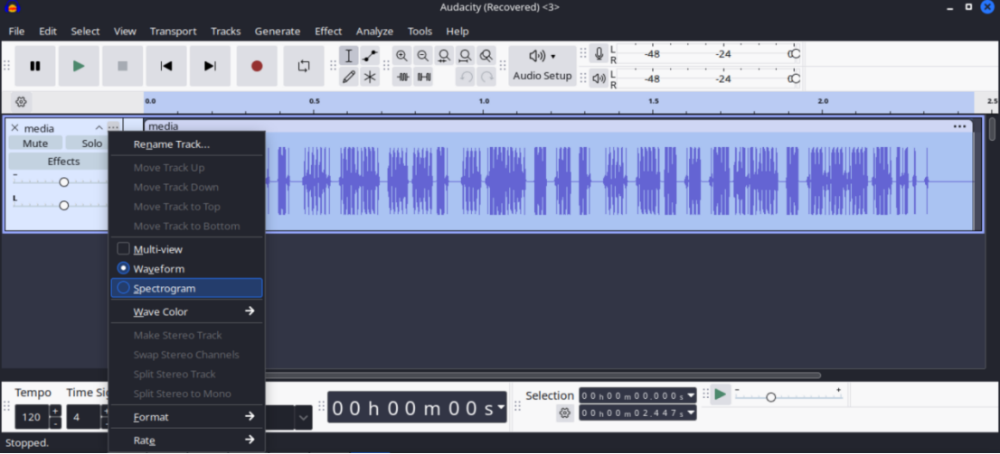
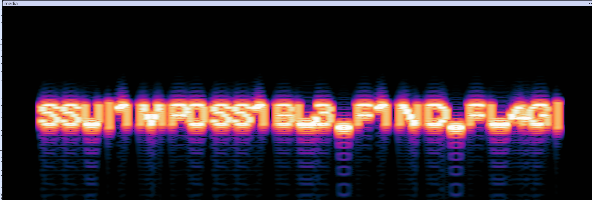

## ИНОПРИШЛЕНЦЫ [medium]
450
steganography medium

# Автор: gr8str8some1
# Решил: gr8str8some1

> Описание: Сенсация!!!!! 
Учёные обсерватории наконец-то поймали чёткий сигнал из космоса! 
Не мусор, не помехи, а явно осмысленное сообщение… или нет? 
— «Доктор, мы принимаем кодовую передачу!» 
— «Это исторический момент, запускайте запись! Мы раскроем тайну Вселенной!» 
— «Доктор… тут странно… Передача… на русском…» 
— «Что?!» 
— «И подпись: “Штирлиц”.» 
Штирлиц сидел в дальнем углу и тихо улыбался. Его радиопередатчик был спрятан в радиотелескопе уже третьи сутки. Он всего лишь пересылал НЕКОМУ КИРИЛЛУ Н. из соседнего отдела ИБ шутливые зашифрованные сообщения. Никто не подозревал, что весь научный совет уже сутки расшифровывает их «секретную переписку», считая её первым контактом с инопланетянами. 
Файл с этой “космической” передачей у вас в руках. Расшифруйте его и поймите, что же Штирлиц хотел передать «Кириллу Н.».

# Решение:
Разорхивировываем, и засовываем в audacity 

Затем, юзаем спектограмму 

