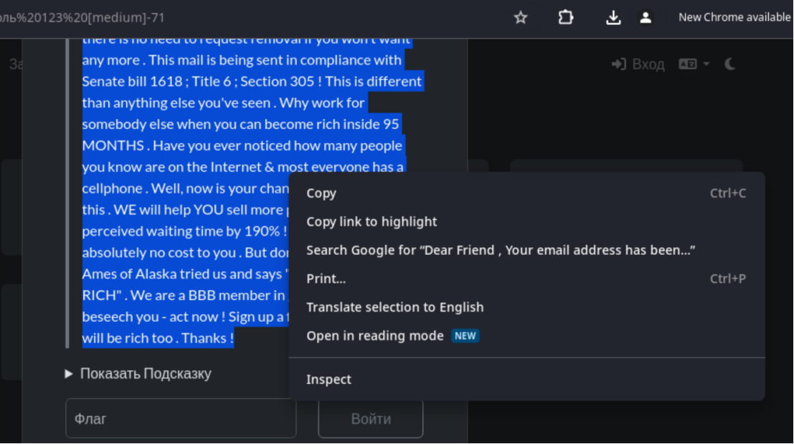
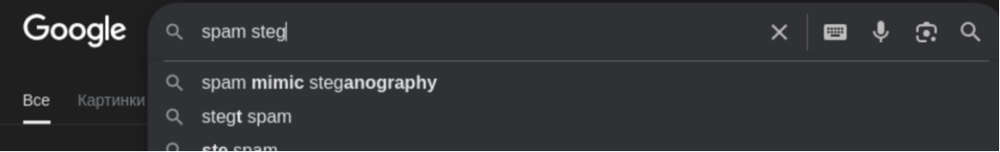
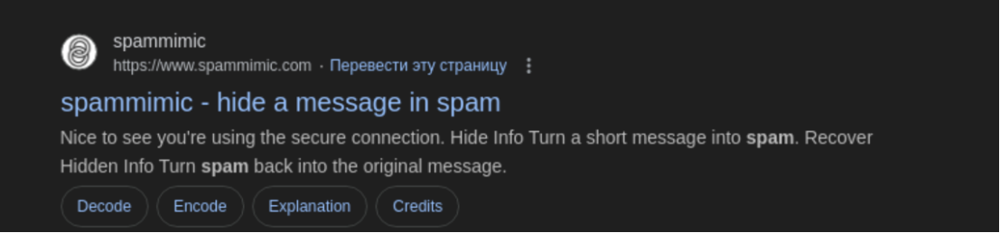
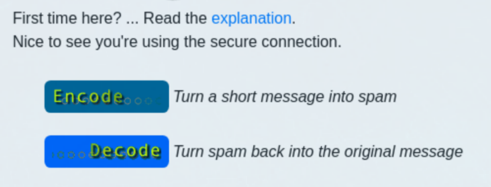
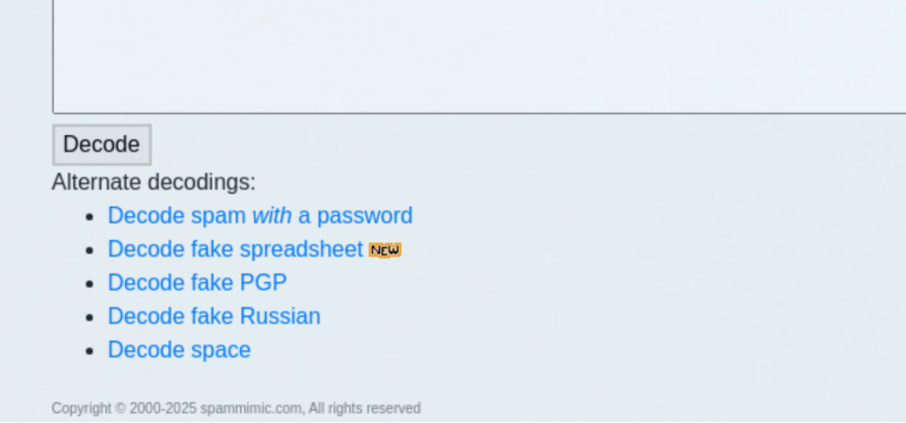
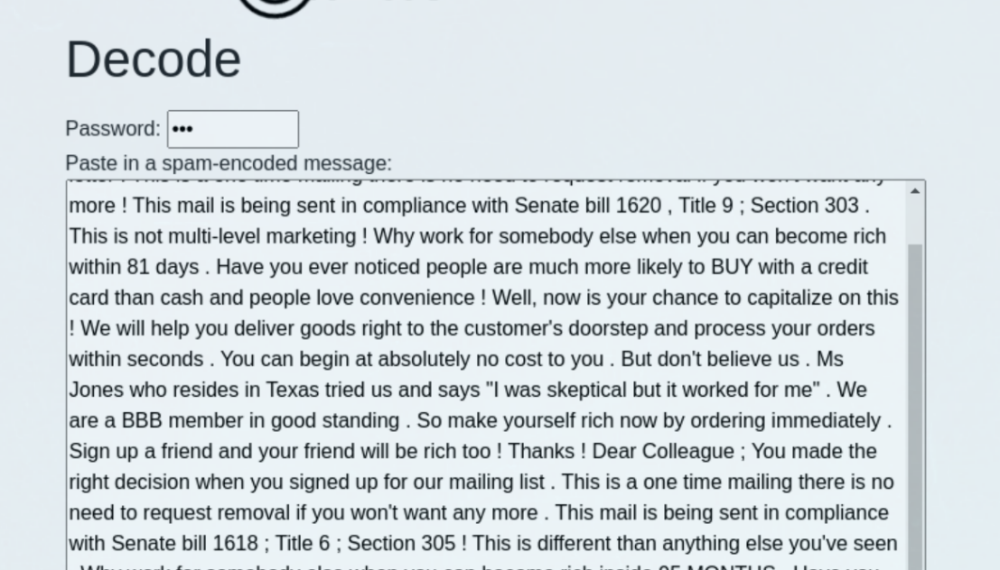
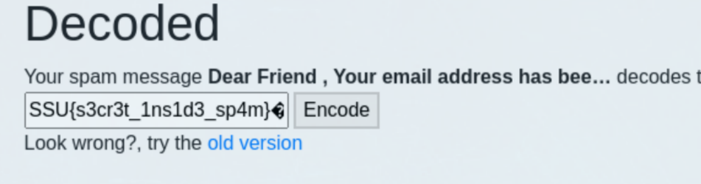

# Пароль 123 [medium]
450
steganography medium

### Автор: gr8str8some1
### Решил: gr8str8some1

> Описание: Dear Friend , Your email address has been submitted to us indicating your interest in our letter ! This is a one time mailing there is no need to request removal if you won't want any more ! This mail is being sent in compliance with Senate bill 1620 , Title 9 ; Section 303 . This is not multi-level marketing ! Why work for somebody else when you can become rich within 81 days . Have you ever noticed people are much more likely to BUY with a credit card than cash and people love convenience ! Well, now is your chance to capitalize on this ! We will help you deliver goods right to the customer's doorstep and process your orders within seconds . You can begin at absolutely no cost to you . But don't believe us . Ms Jones who resides in Texas tried us and says "I was skeptical but it worked for me" . We are a BBB member in good standing . So make yourself rich now by ordering immediately . Sign up a friend and your friend will be rich too ! Thanks ! Dear Colleague ; You made the right decision when you signed up for our mailing list . This is a one time mailing there is no need to request removal if you won't want any more . This mail is being sent in compliance with Senate bill 1618 ; Title 6 ; Section 305 ! This is different than anything else you've seen . Why work for somebody else when you can become rich inside 95 MONTHS . Have you ever noticed how many people you know are on the Internet & most everyone has a cellphone . Well, now is your chance to capitalize on this . WE will help YOU sell more plus decrease perceived waiting time by 190% ! You can begin at absolutely no cost to you . But don't believe us ! Prof Ames of Alaska tried us and says "Now I'm rich, Rich, RICH" . We are a BBB member in good standing . We beseech you - act now ! Sign up a friend and your friend will be rich too . Thanks !

### Решение:
Прям втупую просто гуглим, что это за шняга (научный термин) 

В гугле спокойно узнаём, что это какая-то спам стега 

Ну и переходим, заходив в decode 

Пролистаем чуть ниже, и выберем именно то, что нужно нам: декодер с паролем 

Пароль как раз-таки в названии таска. 

