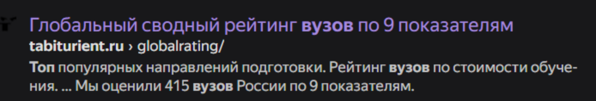
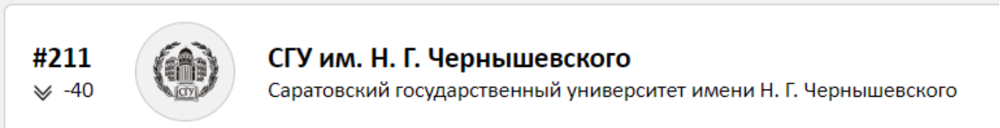
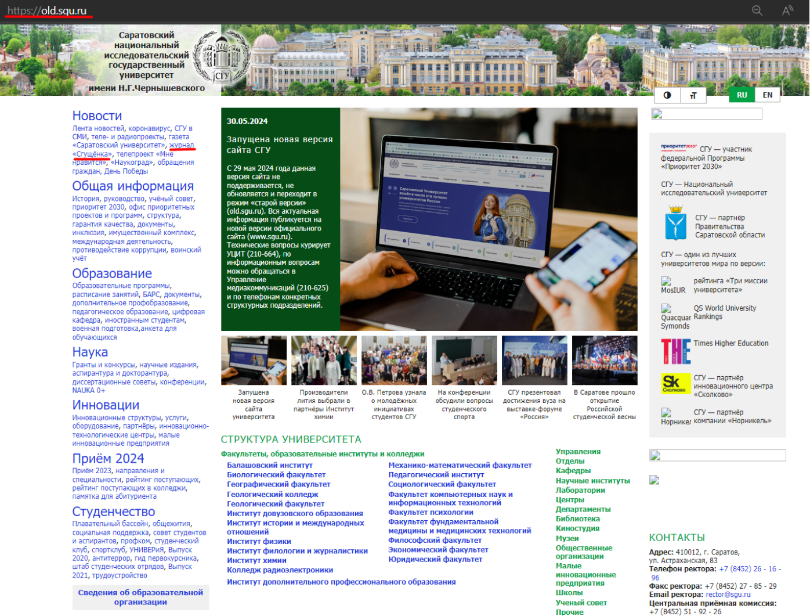
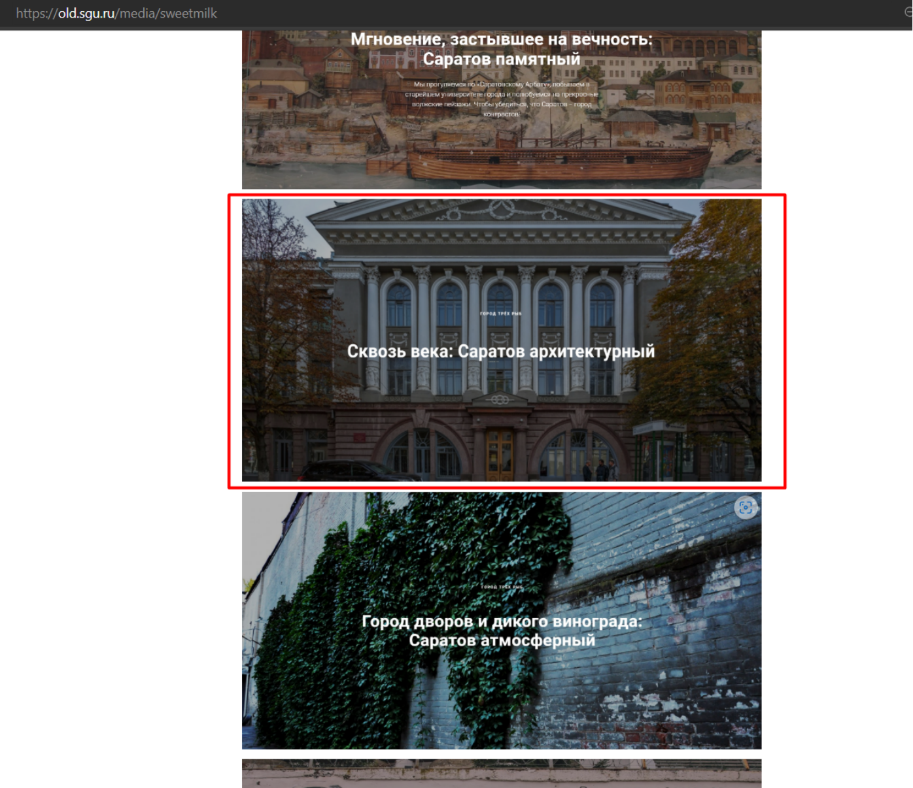

## Абитуриент [easy]
300
osint easy

# Автор: ShahbazovTeymur
# Решил: ShahbazovTeymur

> Описание: Закончил 11-й класс, пора поступать. 
Зашел я на сайт, выбирать институт. 
Полистал я немного, увидел 
Нашел тут один, номер #211. 
 
Решил изучить и найти его сайт. 
Нашел его сайт, а их целых два. 
Ну выбрал один, неудобен дизайн и выглядит странно. 
Куда - то нажал, нашел я журнал... 
 
Заголовок "Сквозь Века" заинтересовал меня. 
Захотел я другу ссылку показать, 
Но дрожащей рукой закрыл браузер я. 
Как быть я не знаю. 
Не могу теперь попасть я туда 
 
Формат флага: SSU{https://....}

# Решение:
1. “Зашел я на сайт выбирать институт” – по строке можно понять, что речь идет о каком то топе / описании вузов, в поисковике ищем – “Топ вузов” / “Рейтинг вузов”, открываем первую попавшуюся ссылку 

2. “Нашел тут один, номер #211” ищем соответствующий вуз с данным номером 

3. “Нашел его сайт, а их целых два” - у сайта СГУ есть два формата – старый и новый. Переходим сразу к старому виду 
4. “Куда - то нажал, нашел я журнал” - изучаем сайт и ищем где-нибудь упоминание журнала

5. Переходим в раздел “журнал “Сгущёнка””
6. “Заголовок "Сквозь Века" заинтересовал меня” – немного пролистав страницу находим раздел с нужным нам заголовком 

SSU{https://saratov-go.tilda.ws/architecture}