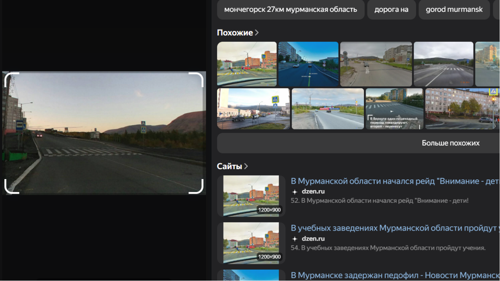
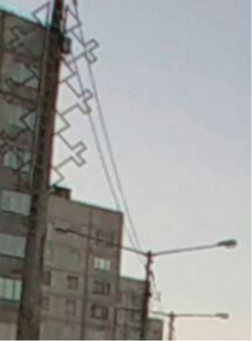
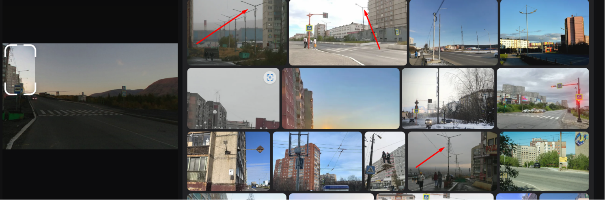
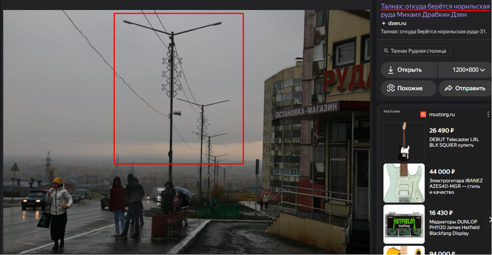

## Nokia [easy]
350
osint easy

# Автор: ShahbazovTeymur
# Решил: ShahbazovTeymur

> Описание: Наш друг Вова часто лунатит по ночам. И вот он очутился в незнакомом месте с разряженным телефоном, все что он успел нам прислать, так это фотографию. Помогите нам найти вову 
Формат флага: SSU{cityName.streetName}

# Решение:
1. Самое простое, что приходит на ум - поиск по картинке 

2. Перебрав первые возможные предложенные варианты, ответа не находим. Тогда попытаемся повыделять разные области фотографии для поиска. Как зацепку можно взять возвышенности на заднем плане 
3. После выделения области у нас появляется в предложениях для поиска город Норильск, район Талнах. С пониманием в какой части города нужна искать, через панораму в яндекс картах приходим к нужному ответу  
>[!NOTE]
> Дополнительно один из вариантов - можно улучшить качество фотографии, тогда поиск по картинке пойдет проще

Другой вариант решения: 
1. Поиск по картинке к быстрому решению не привел, тогда ищем детали, за которые можно зацепиться. Видим, что в городе интересный формат фонарных столбов, зацепимся за них 

2. Также с поиском по картинке, находим похожие столбы 

3. Начинаем изучать картинки и находим соответствие фонарных столбов + узоров с нашими (можно зацепиться и на другие фотографии, много связано с норильском и под многими фотографиями есть ссылки на статьи в Дзен)

4. По итогу приходим к Норильску, р Талнах

SSU{Норильск.Рудная}