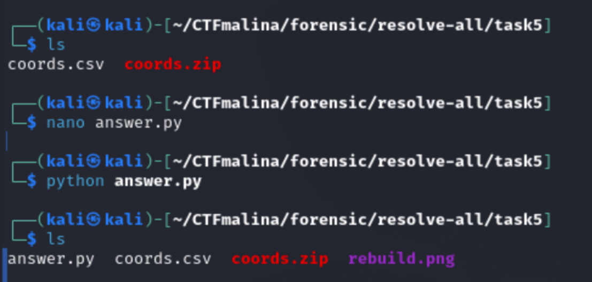

# GPS-хаус [easy]
400
osint easy

### Автор: gr8str8some1
### Решил: gr8str8some1

> Описание: Мы повесили слежку за Штирлецом. Прошло всего 15 минут, но он уже побывал везде где только можно! Без шуток, их настолько много, что хоть портрет самого Штирлеца собирай.<br>
«Ничего себе, спутниковое селфи!», — подумал Штирлец и пошёл дорисовывать себе усы.

### Решение:
Смотрим, что в архиве:<br>


В эксельке у нас координаты. <br>
```bash
import pandas as pd, numpy as np
from PIL import Image

df = pd.read_csv("coords.csv")

lat_steps = np.abs(np.diff(np.sort(df.latitude.unique())))
lon_steps = np.abs(np.diff(np.sort(df.longitude.unique())))
delta = np.round(np.min(np.concatenate([lat_steps, lon_steps])), 6)

min_lat, max_lat = df.latitude.min(), df.latitude.max()
min_lon, max_lon = df.longitude.min(), df.longitude.max()

height = int(round((max_lat - min_lat) / delta)) + 1
width  = int(round((max_lon - min_lon) / delta)) + 1
img = np.full((height, width), 255, np.uint8)

for lat, lon in df.to_numpy():
    y = int(round((max_lat - lat) / delta))
    x = int(round((lon - min_lon) / delta))
    img[y, x] = 0

Image.fromarray(img).save("rebuild.png")
```


К слову, на гугл картах выглядит как-то так<br>


Ну а дальше, чем душе угодно: утилиты/сайты/камера телефона<br>
