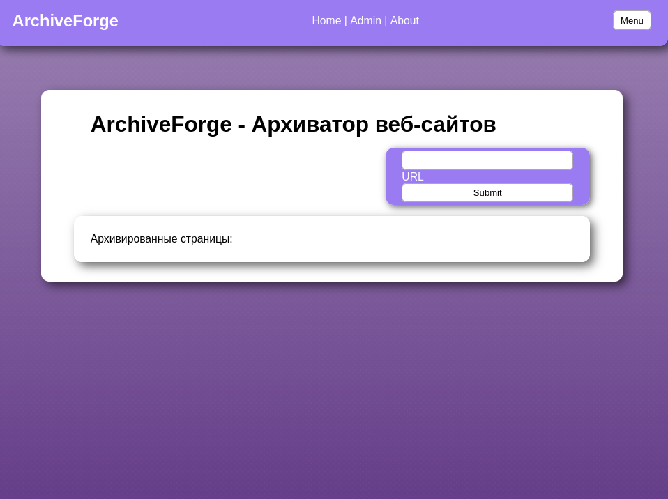
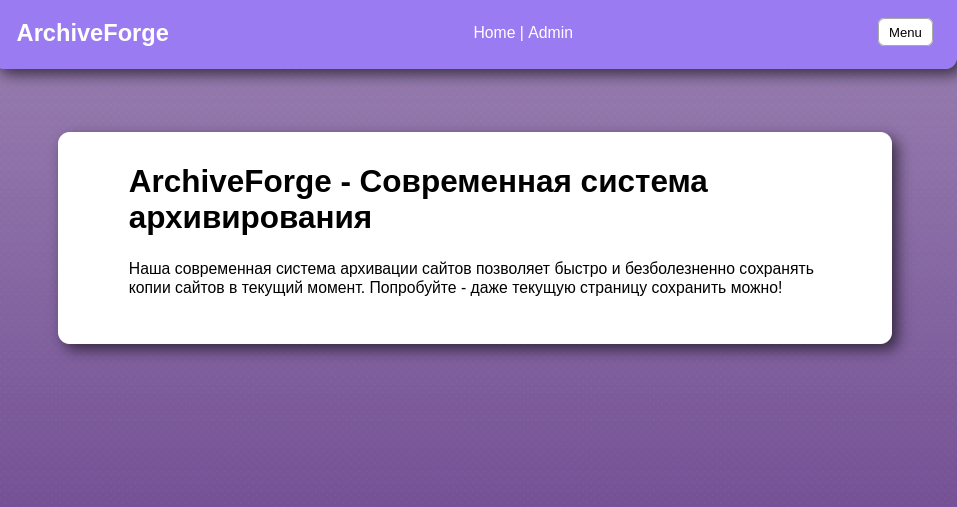
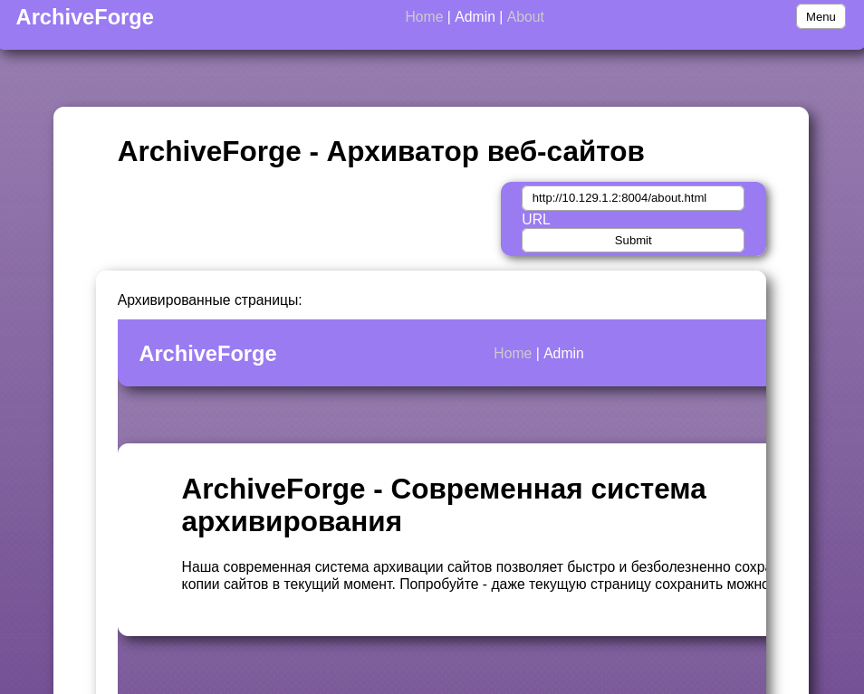
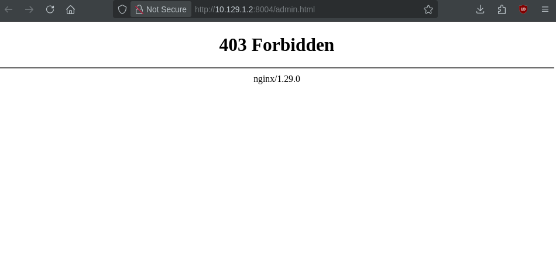
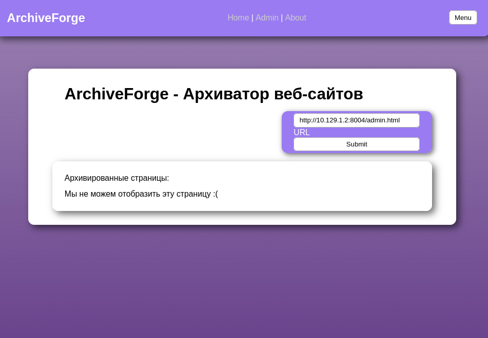
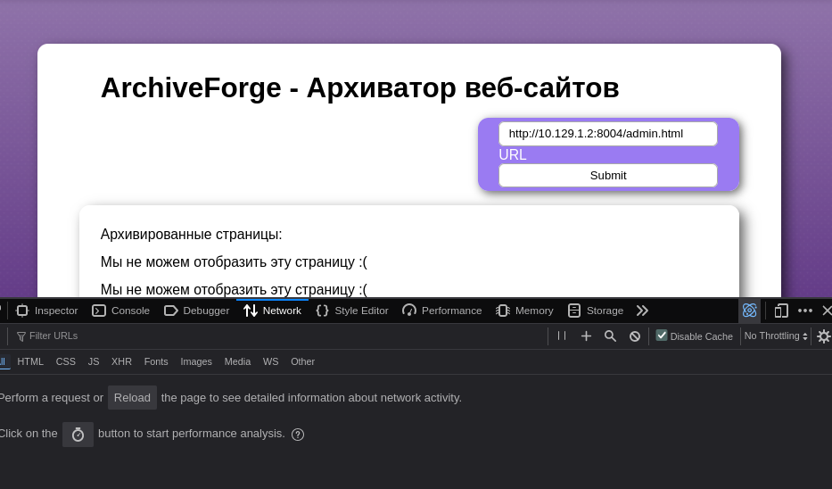
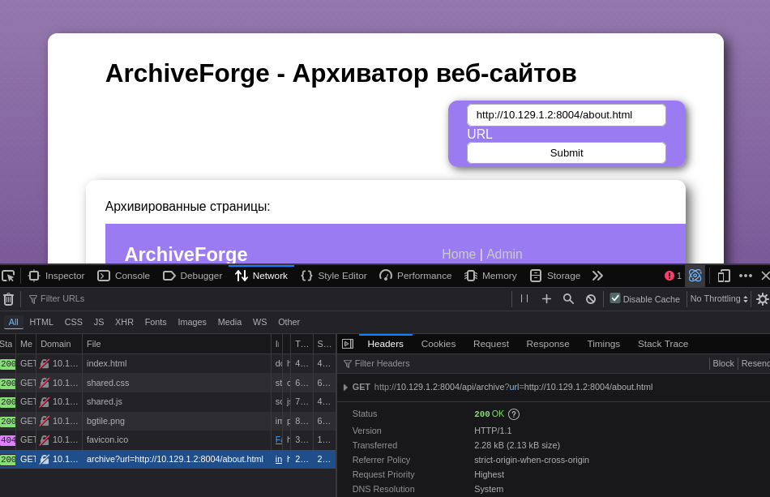

ArchiveForge
----------------

# Автор: gr8str8some1
# Решил: gr8str8some1

Описание:
```
Мы создали собственный сайт для создания архивов сайтов. Попробуйте, он и сам себя умеет архивировать!
```

Флаг: ``SSU{s3rv3r_s1d3_arch1ve-ADASnn2}``

Решение:

1. Откроем сайт



Также откроем страницу About.



В описании сайта указано, что сайт позволяет архивировать страницы с других сайтов.

2. Попробуем архивировать страницу About



Сайт теперь отображает страницу About внутри списка архивированных страниц.

Так как код страницы был вставлен в текущую страницу без использования iframe, можно предположить, что запрос был сделан со стороны сервера. Это открывает такой класс атак, как SSRF - Server-Side Request Forgery, или подделка запросов со стороны сервера.

Класс атак типа SSRF позволяет злоумышленнику заставить сервер от своего имени обратиться к защищённому ресурсу. Такие атаки могут позволить злоумышленнику обратиться, например, к ресурсам, находящимся за рамками демилитаризованной зоны (DMZ), т.е. в локальной сети сервера. Это открывает доступ к скрытым внутри локальной сети API, административным панелям, внутренним сервисам компании и другим хостам. Также, в случае наличия на сервере ограничений доступа к страницам, запрос со стороны сервера может нарушить эти ограничения (например, если происходит фильтрация страницы относительно IP адреса запрашивающей стороны.)

3. Попробуем перейти на страницу Admin



Очевидно, пользователю запрещено заходить в панель администратора.

4. Попробуем архивировать страницу Admin



Если внимательно посмотреть на исходящие запросы, при попытке архивации страницы admin запрос не отправляется



Однако если произвести это со страницей about, то на сервер отправляется запрос к эндпоинту `/api/archive?url=`.



Это должно навести на мысль, что ограничения на архивацию страницы admin находятся где-то на стороне клиента.

В таком случае, можно сконструировать запрос к API напрямую

5. Архивируем страницу Admin используя эндпоинт API


Получаем флаг

> Альтернативно, можно было бы удалить JavaScript код, отвечающий за проверку на наличие строки "admin" в url текста. Можно также попытаться обойти сам фильтр методами обхода WAF, но это было бы нецелесообразно.

Ресурсы:
- https://book.hacktricks.wiki/en/pentesting-web/ssrf-server-side-request-forgery/index.html
- https://portswigger.net/web-security/ssrf