AskQl
-----

# Автор: unatcoman
# Решил: unatcoman

Описание:
```
Мы составили список наших сотрудников, и вроде бы он полный, но наш админ базы данных что-то скрывает. Можешь разузнать?
```

Флаг: ``SSU{4sk_4nd_yOu_sh4ll_r3c3iv3-XLLDAGB761}``

Решение:

1. Откроем страницу сайта

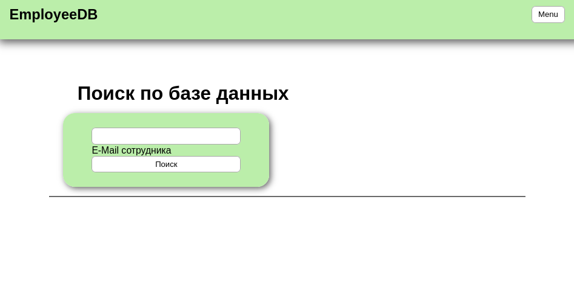

Если взаимодействовать с формой поиска, получим список сотрудников. Поле поиска в данном случае ищет по email сотрудников.

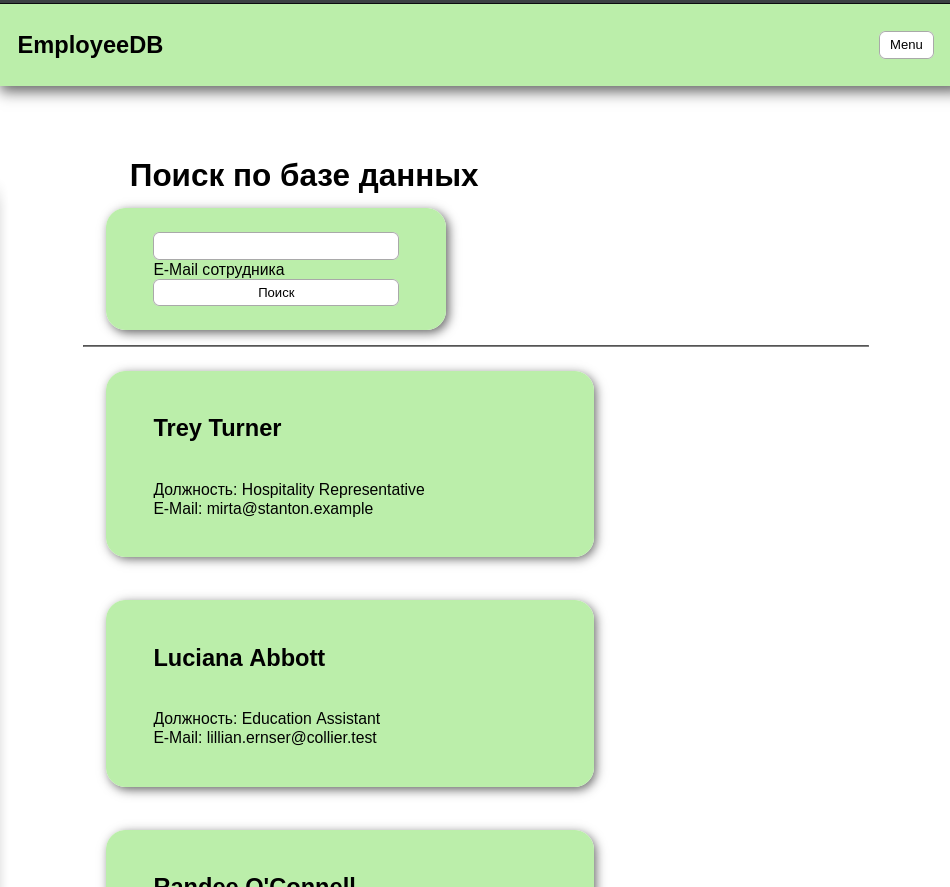

Возможно, на стороне сервера используется база данных SQL. Предполагая эту особенность, есть потенциал того что поле поиска уязвимо перед атаками класса SQL Injection

Класс атак SQL Injection работает на небезопасном формировании текстового запроса в СУБД. Так, например, если на стороне сервера используется запрос `"SELECT * FROM user_table WHERE user='$EMAIL';`, где `$EMAIL` - это параметр поиска, то при подстановке любого текста, не содержащего одинарную кавычку, запрос обработается корректно. Однако, если запрос содержит кавычку, например если пользователь введёт текст `jerry's pizzeria`, то при подстановке запрос будет выглядеть следующим образом: `"SELECT * FROM user_table WHERE user='jerry's pizzeria';"`. В этом запросе всё что идёт после `user='jerry'` становится синтаксисом SQL запроса, и, так как это неверный синтаксис, возникнет ошибка.

Злоумышленник может использовать эту ошибку при подстановке для внедрения собтсвенного синтаксиса SQL запроса. Это и есть SQL Injection - оно же "инъекция SQL".

2. Протестируем форму на предмет наличия уявзимости SQL Injection

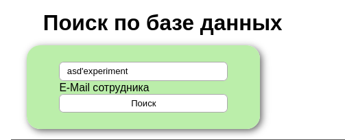

(Ответы сервера будем рассматривать через инспектор браузера, так как они более деатльные. При желании для взаимодействия с эндпоинтом базы данных можно бы также было воспользоваться curl и jq.)

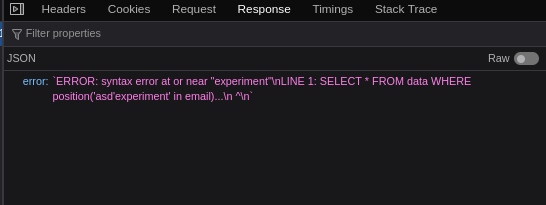

Как мы видим, при обработке запроса возникла ошибка, которая при этом возвращает нам часть синтаксиса SQL запроса.
Воспользуемся этим фактом и сконструируем рабочй SQL запрос.

> Замечание: В общем случае, сервер может и не отправлять ошибку, а только сигнализировать о ней пользователю. В таком случае может потребоваться перебор возможных синтаксических конструкций чтобы получить валидный синтаксически запрос.

3. Отправим запрос с SQL инъекцией, которая дополнит строку запроса до синтаксически корректной.

`' in '')>0;--` - в такой форме полный запрос будет выглядеть как `SELECT * FROM data WHERE position('' in '')>0;--' in email)>0;`, при этом всё что идёт после `--` считается комментарием. Таким образом, без комментариев запрос будет выглядеть как `SELECT * FROM data WHERE position('' in '') > 0;`, что должно выдать все строки таблицы

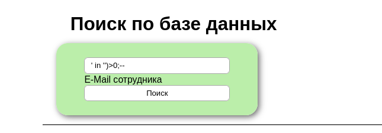

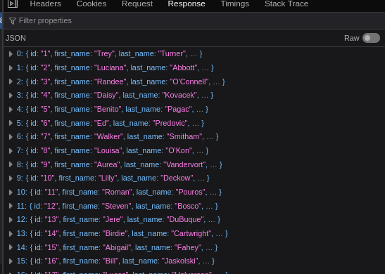

4. Определим версию SQL-сервера

> Замечание: Данный этап не всегда обязателен, так как при работе может возникнуть интуитивное предположение о версии сервра. Однако иногда это помогает понять некоторые особенности (такие, например, как наименование мастер-схемы).

> Замечание 2: В дальнейшем будет использоваться подстановка дополнительной команды SQL, заместо более классического подхода на основе объединения (UNION) с таблицей из подзапроса. Здесь такой метод работает заметно эффективнее, но такой метод будет работать не всегда - некоторые SQL библиотеки проверяют, что запрос состоит всего из одной комманды. UNION подход работает в большем количестве случаев.

Проверим на факт использования SQL Server

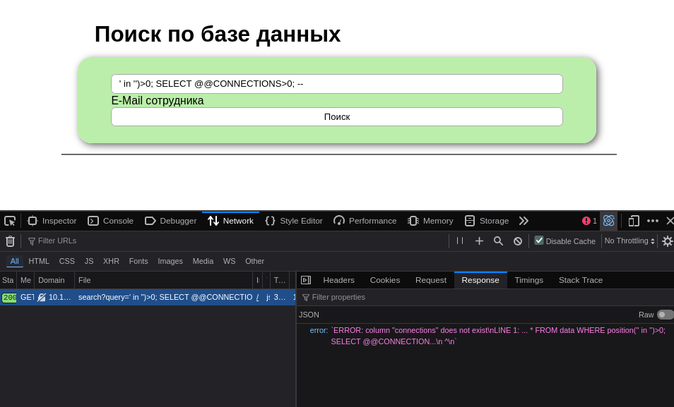

Данный запрос вернулся с ошибкой - вероятно, используется иной вендор СУБД

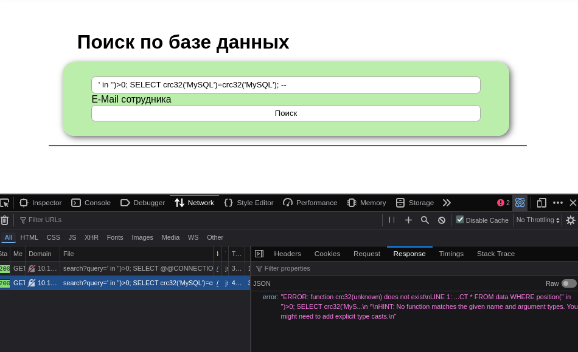

Данный запрос также вернулся с ошибкой - значит, используется не MySQL

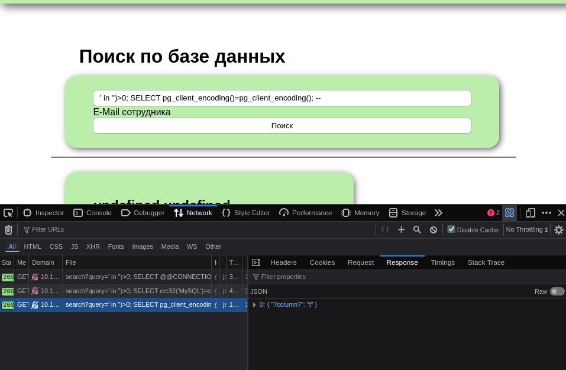

Запрос обработался успешно. Следовательно, на бэкенде используется PostgreSQL.

5. Получим список всех доступных таблиц

Список всех таблиц из всех доступных схем в PostgreSQL хранится в схеме `information_schema`, в таблице `tables`

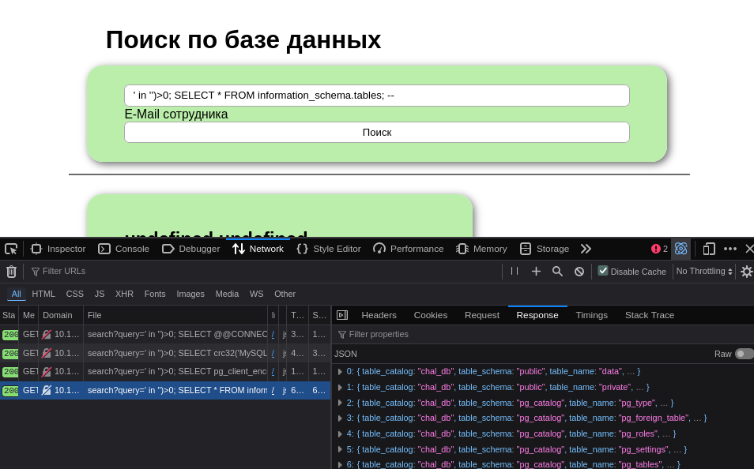

В схеме public есть как минимум две таблицы - одна из них data, другая private. Можно предположить, что доступ к таблице private нас интересует в первую очередь. Попробуем прочитать строки из данной таблицы.

6. Обратимся к таблице `private`

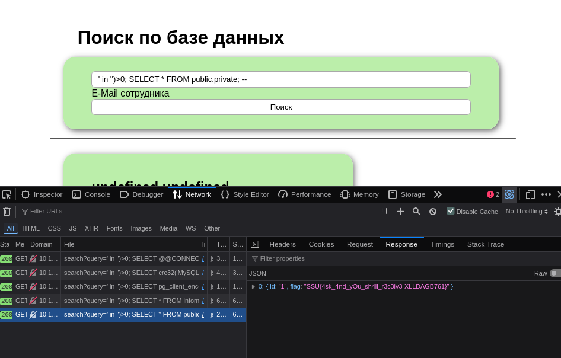

Получаем флаг

Ресурсы:
- https://book.hacktricks.wiki/en/pentesting-web/sql-injection/index.html
- https://portswigger.net/web-security/sql-injection