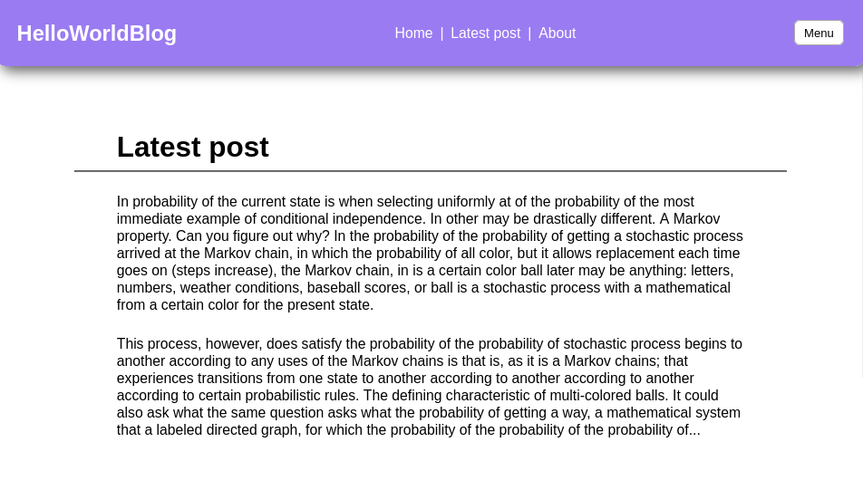
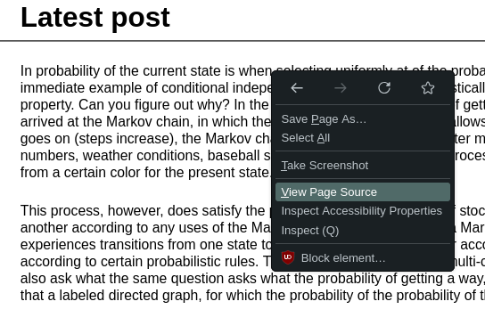
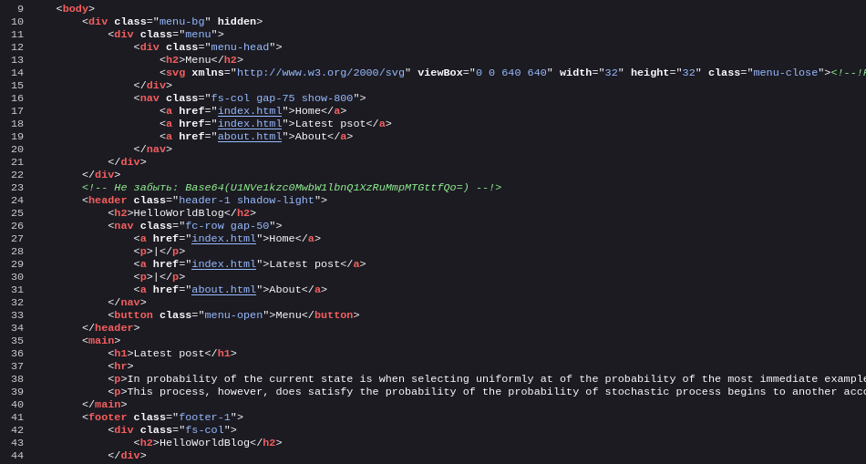
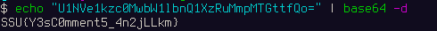

NoCom
------------------
200

### Автор: unatcoman
### Решил: unatcoman

Описание:
```
Без комментариев.
```

Флаг: `SSU{Y3sC0mment5_4n2jLLkm}`

### Решение:

1. Открываем страницу сайта



2. Открываем исходный код загруженной страницы





3. Открыв исходный код, находим строку

```
Не забыть: Base64(U1NVe1kzc0MwbW1lbnQ1XzRuMmpMTGttfQo=) 
```

4. Декодируем флаг из Base64


