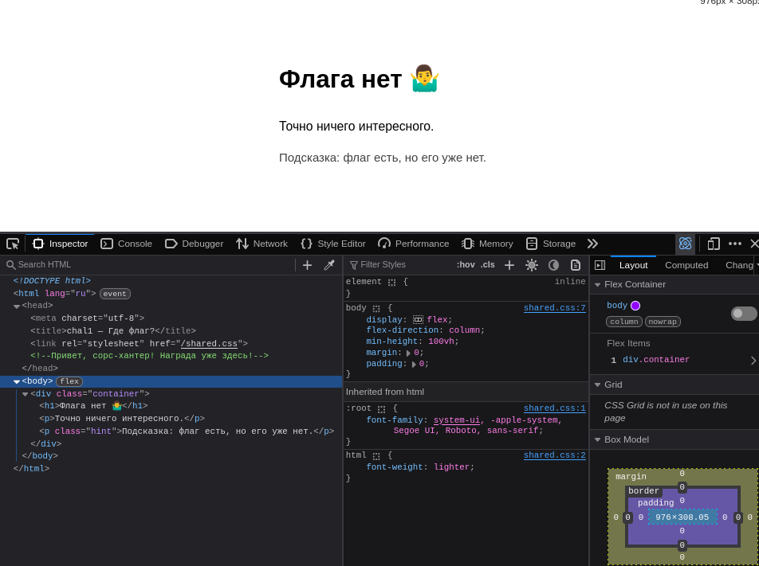
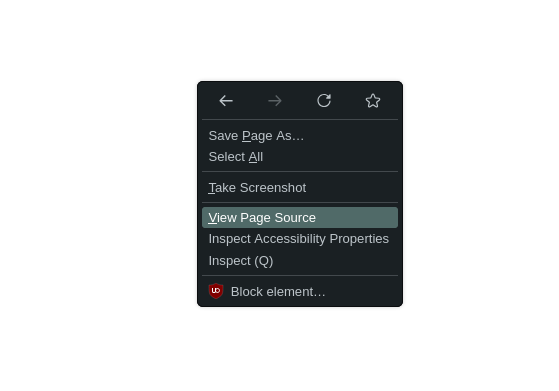
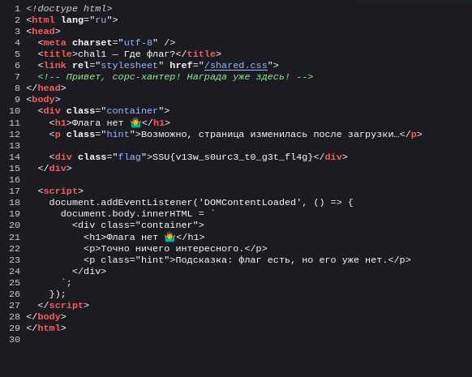

Кореш - глаза не врут
---------------------------------
200

### Автор: gr8str8some1
### Решил: unatcoman

Описание:
```
Здесь флага точно нет... если верить глазам. 
```

Флаг: `SSU{v13w_s0urc3_t0_g3t_fl4g}`

### Решение:

1. Открываем страницу сайта



2. Открываем код сайта





Получаем флаг

> Замечание: Задача немного отличается от NoCom. В частности - в страницу встроен скрипт, убирающий флаг при использовании инспектора. Стоит помнить, что инспектор показывает код как он есть на данный момент - а это, в свою очередь, может изменяться скриптами при загрузке.

