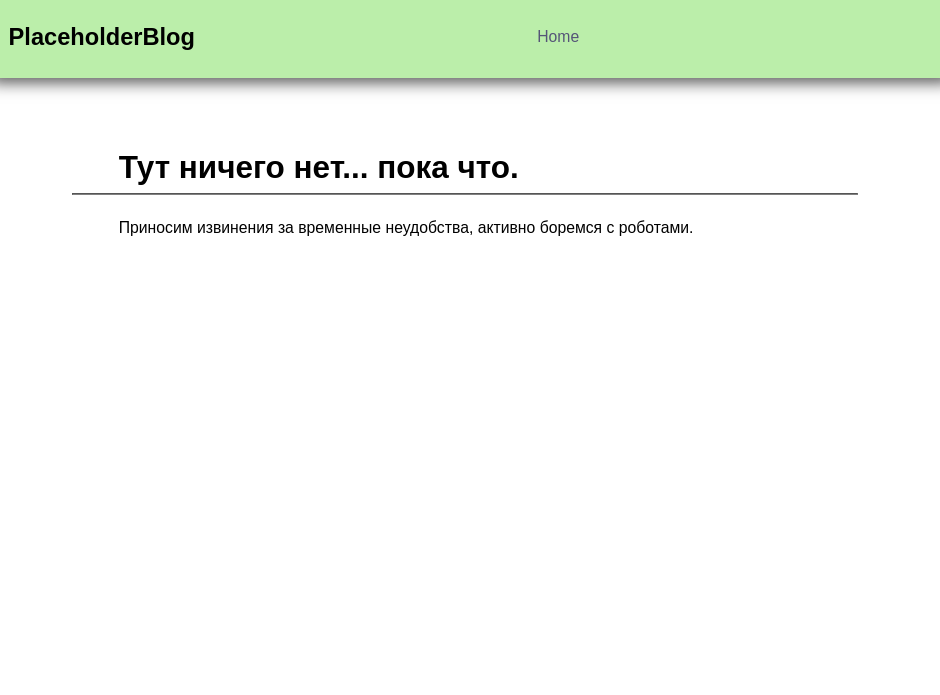
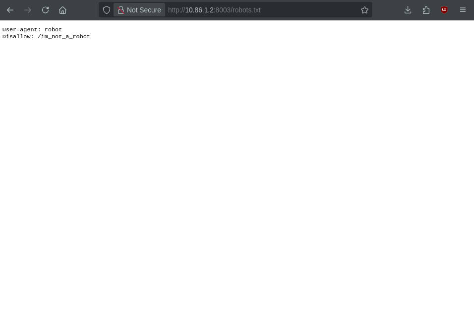
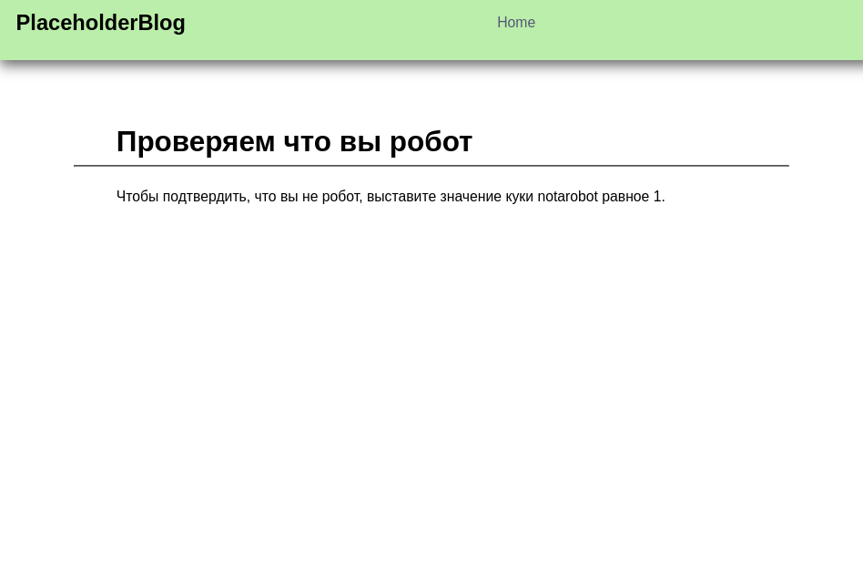
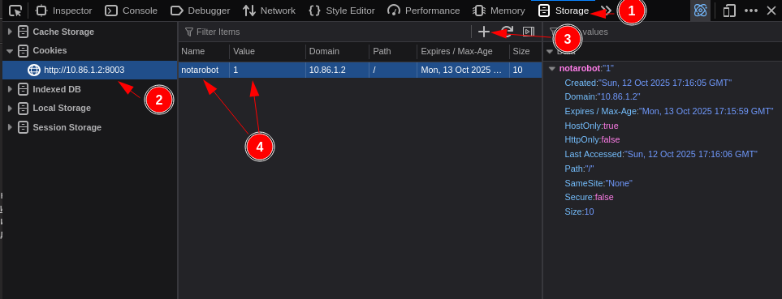
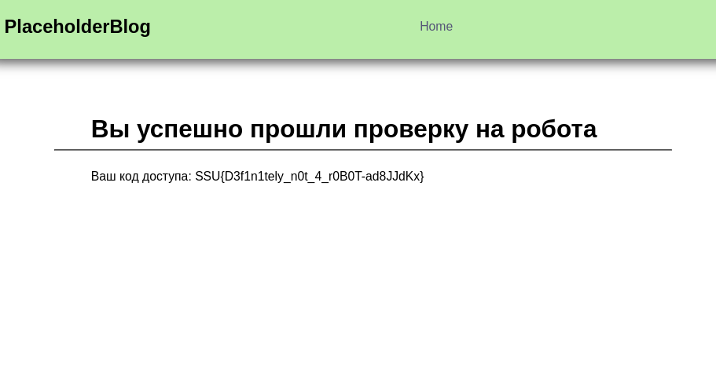

CaptchaButBetter
----------------

# Автор: unatcoman
# Решил: unatcoman


Описание:
```
Вы не подумайте лишнего, мы человеколюбивы. А вот роботы нам очень не нравятся.
```

Флаг: `SSU{D3f1n1tely_n0t_4_r0B0T-ad8JJdKx}`

Решение:
1. Открываем сайт



Видим упоминание "борьбы с роботами" (как и в описании задачи и названии). Традиционно в HTTP есть некоторые имена URI, зарезервированные для целей стандартизации (favicon.ico, [.well-known](https://en.wikipedia.org/wiki/Well-known_URI), и др.). Один из таких URI - [`robots.txt`](https://ru.wikipedia.org/wiki/%D0%A1%D1%82%D0%B0%D0%BD%D0%B4%D0%B0%D1%80%D1%82_%D0%B8%D1%81%D0%BA%D0%BB%D1%8E%D1%87%D0%B5%D0%BD%D0%B8%D0%B9_%D0%B4%D0%BB%D1%8F_%D1%80%D0%BE%D0%B1%D0%BE%D1%82%D0%BE%D0%B2). `robots.txt` используется для указания ботам поисковиков на важные страницы, запрещённые страницы, а также на скорость с которй желательно переходить по ссылкам для индексирования страниц.

2. Откроем URI `/robots.txt`



Здесь мы можем увидеть URI, запрещённый для просмотра роботам. Мы, к счастью, не обладаем кремниевыми внутренностями, так что нам можно туда пройти.

3. Перезодим по URI `/im_not_a_robot`



На странице для подтверждения того, что мы не робот, требуется создать куки `notarobot` и выставить для него значение `1`. 

4. Создаём куки `notarobot` и перезагружаем страницу.





Получили флаг