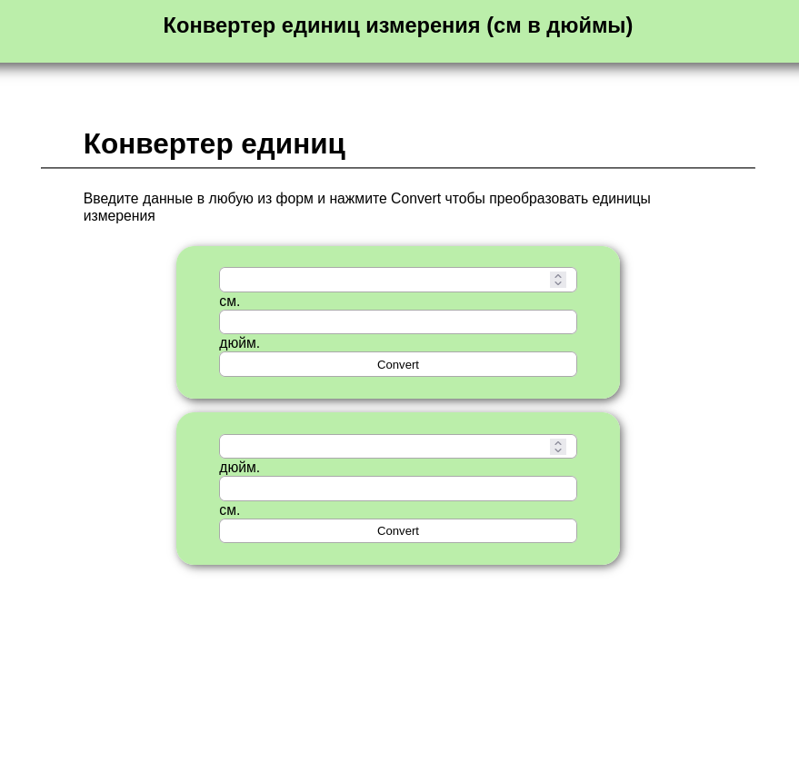
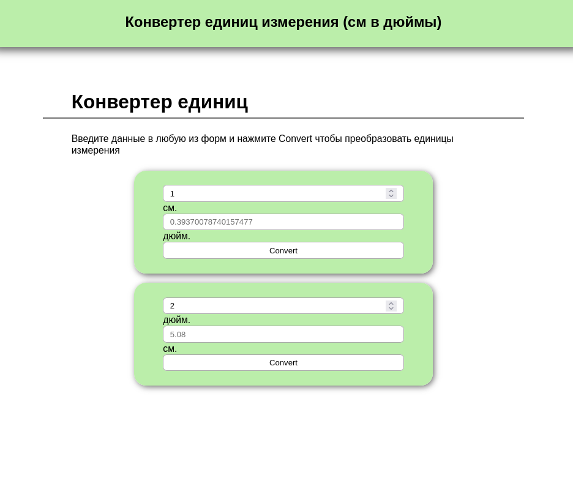
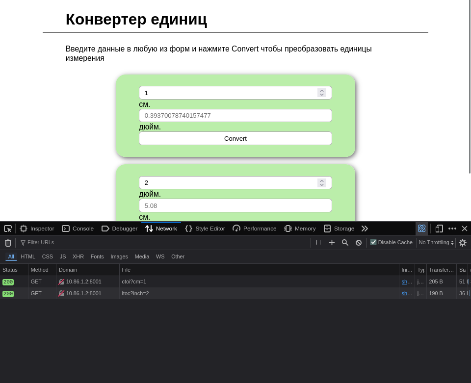
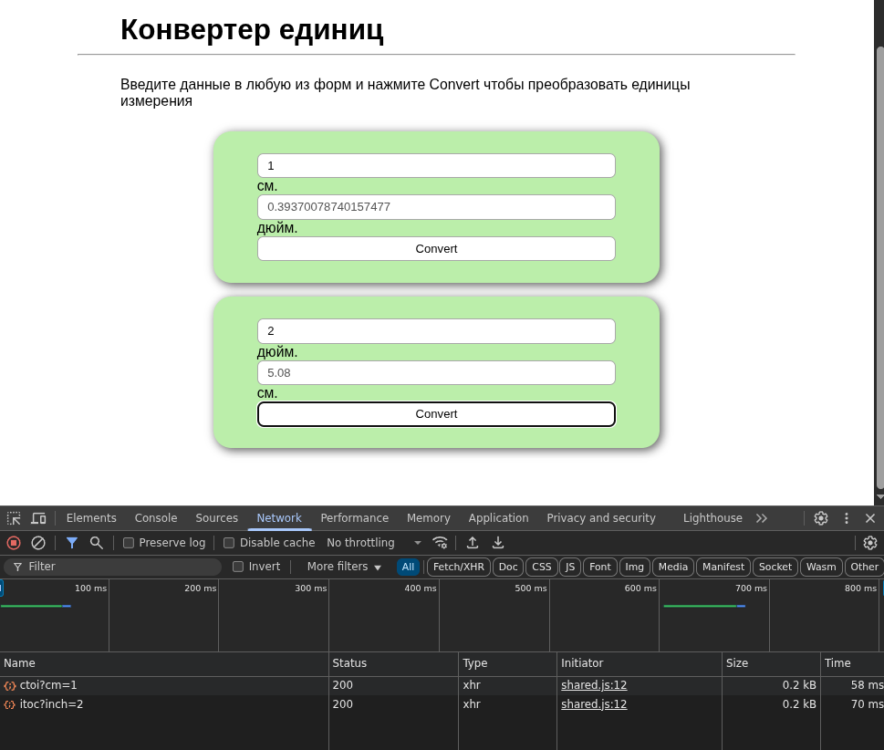
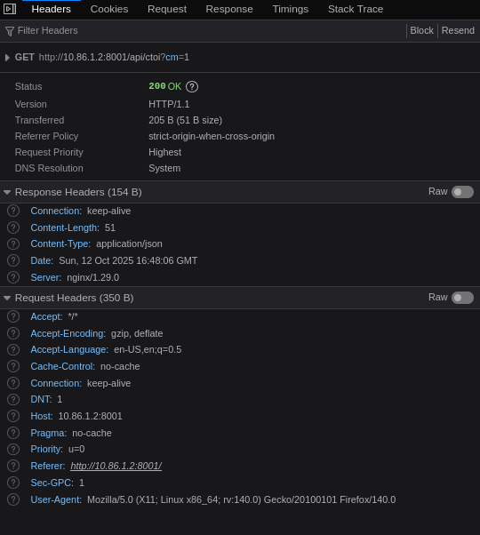
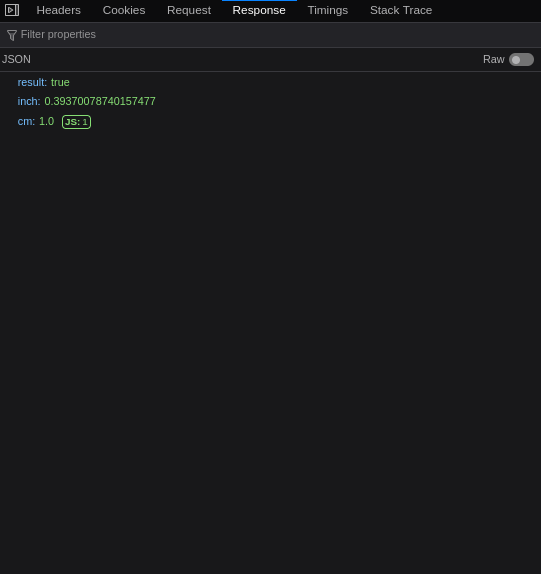
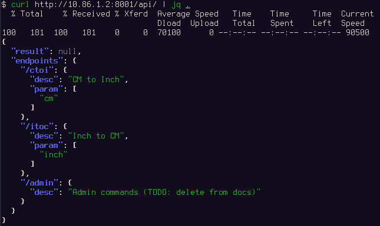
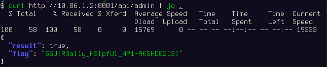

HelpfulApi
----------

# Автор: unatcoman
# Решил: unatcoman

Описание:
```
Мы тут такую крутую апишку сделали, всё умеет, всё может, даже документацию
писать не нужно!
```

Флаг: `SSU{R3al1y_H3lpfUl_4P1-AKSHD8213}`

Решение:

1. Открываем страницу сайта



2. Пробуем ввести значения в поля конверсии единиц и нажимаем кнопку Convert



Это создало запрос, который можно отследить в инструментах разработчика.

Для Firefox: 

Для Chromium(Chrome/Brave/Yandex/Opera GX и прочие): 


3. Смотрим информацию запроса





Видим, что на стороне сервера используется API, конвертирующий единицы измерения.

4. Попробуем обратиться к URL /api/ (используя curl из коммандной строки, и JQ для приведения JSON ответа в более человекочитаемый вид)



> Замечание: В общем случае, API вряд ли бы вывел документацию к самому себе. В большинстве реальных случаев для документации API будут использоваться инструменты наподобие Swagger, отвечающие за документирование и проверку интерфейсов на основе OpenAPI.

Видим, что API вывел документацию к ресурсам. Среди них - эндпоинт /admin, который должен быть скрыт из общего доступа.

5. Попробуем произвести запрос к эндпоинту /admin.



Получаем флаг.


