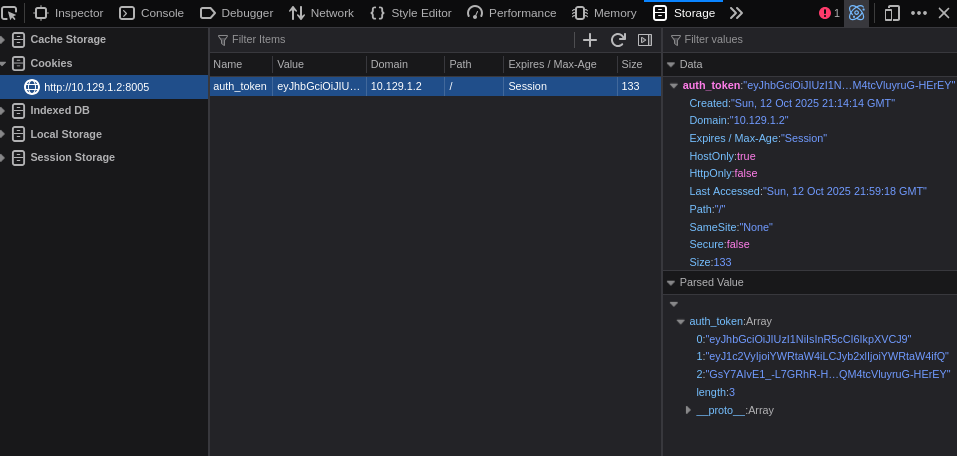

JawaToken
---------
1000

### Автор: randmik42
### Решил: unatcoman

Описание:
```
Чё там нынче в фреймворках популярного? Токены, значит... значит будем делать токены!
```

Флаг: ``SSU{aL0_Jw7_dA_dA_R@nd0M}``

### Решение:

1. Откроем сайт


Попробуем зарегистрировать пользователя


Очевидно, нам нужно каким-нибудь образом увидеть поле флаг.

Также, раз уж мы зарегистрировались, у нас скорее всгео должны были появиться куки.
Проверим куки сайта.


Если внимательно посмотреть на формат куки, можно заметить что формат состоит из трёх точек, разделяющих цифро-буквенные последовательности. На факт этого разделения также будет намекать Firefox при открытии информации о куки


Для тех, кто успешно прошёл NoCom цифро-буквенные последовательности могут вызывать лёгкое ощущения дежавю. Это не просто так, каждые из трёх последовательностей - действительно закодированы Base64. А сам формат хранения куки известен как [JWT - JSON Web Token](https://ru.wikipedia.org/wiki/JSON_Web_Token).

JWT-куки обладают несколькими хорошими для веб-приложений свойствами:

- В них можно безопасно хранить строки со спецсимволами (а в обычных куки - нет. Для самых любознательных - читайте как устроен заголовок `Cookie:`).
- В них уже встроен контейнер JSON для хранения сложных структур (об этом чуть ниже)
- Их трудно подделать на стороне клиента

Три части JWT-куки содержат, в порядке их появления:

- Закодированный Base64 словарь в формате JSON, содержащий информацию об алгоритме хеширования для HMAC-кода
- Закодированный Base64 JSON словарь с идентификационной информацией (имя пользователя, ID пользователя, или иные произвольные данные сесси)
- Закодированный Base64 HMAC-код

Аутентичность куки (факт неподдельности) определяется с помощью HMAC-кода, который формируется из первых двух частей JWT, и секретного ключа, формируемого на сервере. Сервер может легко проверить что данные куки не были изменены, повторно сгенерировав HMAC-код, и сравнив его с тем что хранится в третьей части куки. Если коды отличаются, значит, куки была подделана. В таком случае сервер может просто сбросить куки пользователя и заставить его войти в сервис заново.

> Замечание: На практике есть похожий на JWT формат - ItsDangerous, который исользуется одноимённой библиотекой для Python. Но его легко отличить от JWT потому, что средняя часть куки будет статистически короче, чем у JWT, и будет декодироваться не в JSON словарь, а в бинарную строку. Для работы с куки ItsDangerous существует инструмент [flask-unsign](https://github.com/Paradoxis/Flask-Unsign).

Используя веб-приложение <jwt.io>, рассмотрим содержимое куки

> Замечание 2: Не передавайте реальные куки случайным сайтам (а в лучшем случае - не копируйте куки на другие сайты впринципе). Здесь это относительно безопасно потому что в худшем случае скомпрометирован будет только аккаунт для веб-приложения в рамках таски для CTF. А вам оно вряд ли очень то и нужно, тем уж более с логином amongus и паролем amongus.


Вероятно, нам стоит подняться до роли "admin" и зайти под именем пользователя "admin".

2. Проанализируем код приложения


Открыв App.py, сразу же натыкаемся на пару интересных особенностей:

- Для подписи куки используется секретный ключ, генерируемый функцией generate_secret() при запуске
- generate_secret() может сформировать всего около 10000000 возможный ключей
- Ключ всегда имеет формат "secret_{ЧИСЛО}"
- В приложении уже создан некоторый пользователь admin, в параметрах которого находится флаг

На самом деле, этой информации нам уже хватает для того чтобы забрутить миллион возможных ключей. Это не так много как кажется - что-то типо около 5 минут работы, и это на не самом быстром интерпретаторе Python. Но если посмотреть внимательнее, а не бежать сломя голову писать брутилку, можно увидеть следующий эндпоинт:


Посмотрим на код чуть ранее


Видно, что seed для генератора случайных чисел формируется из времени запуска, которое мы можем узнать из информации эндпоинта debug.

3. Обратимся к эндпоинту debug


Теперь мы имеем на руках время запуска, и всю информацию, необходимую для генерации секрета. Именно это мы и сделаем.

4. Генерируем секретный ключ подписи


Проверим, что ключ действительно подходит, подставив ключ в поле ключа на jwt.io


Приложение отвечает что наша кука валидна, теперь мы имеем ключ подписи для JWT. А значит, мы можем подписать свою собственную куки ключом сервера.

5. Делаем собственную куки


6. Подставляем куки в браузер



7. Перезагружаем страницу


Мы получили флаг