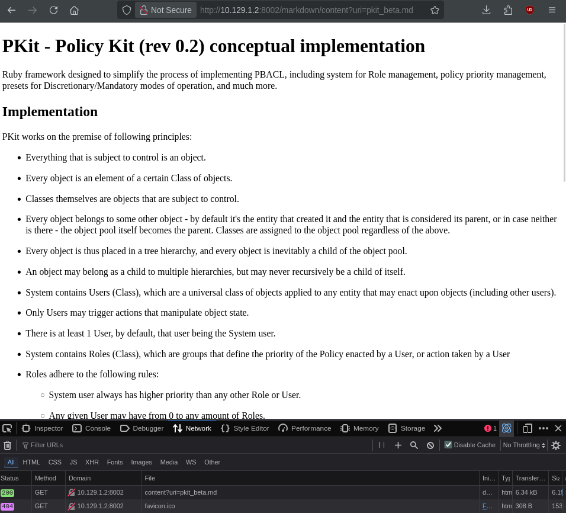

LocalFiles
----------------
1000

### Автор: unatcoman
### Решил: unatcoman

Описание:
```
Мы делаем редизайн сайта, и поэтому выкатили публичную демку. В новой системе весь контент на сайте написан на языке Markdown, что заметно упрощает написание страниц.

P.S. На случай если понадобится доступ к админке, данные лежат в /flag.txt
```

Флаг: ``SSU{L0cal_F1l3s_4nd_M0r3-AD661VCOI}``

### Решение:
1. Открываем сайт


2. Пробуем перейти по различным страницам


Внешне может показаться, что сайт предоставляет статичный контент. Однако, если внимательно посмотреть на отправляемые браузером запросы при загрузке, можно заметить, что контент подргужается динамически.


Для загрузки контента используется эндпоинт `/markdown/content?uri=...` 

3. Попробуем сделать запрос напрямую к эндпоинту `/markdown/content`



Видно, что эндпоинт преобразует текст markdown-документа в HTML-код. Документ который преобразуется на эндпоинте указан в параметре `uri`.

Так как здесь параметрично указывается путь до файла на сервере, здесь возможен класс атак включения локальных файлов (Local File Inclusion, LFI).

Этот класс атак характеризуется отсуствием проверки или ограничения пути открываемых файлов, путь до которых задаётся параметром пользователя.

Так, например, если скрипт на сервере открывает файл `"/var/www/html/"`+`"$FILE"`, где `$FILE` - передаваемый пользователем параметр, для простых запросов сервер будет открывать нужные файлы (например, если `$FILE` = `cats.jpeg`, то сервер откроет файл `/var/www/html/cats.jpeg`). Однако злоумышленник может передать параметр, ссылающийся на директории выше (используя относительный путь вида `../`, например - `$FILE` = `../../../../../../etc/passwd` => сервер откроет файл `/var/www/html/../../../../../../etc/passwd`, который преобразуется в `/etc/passwd`).

В наиболее общем случае, атаки класса LFI случаются при формировании пути конкатенацией (присоединением) строк (`"/var/www/html/" + PATH` в Python), или интерполяцией (подстановкой) строки (`f"/var/www/html/{PATH}"` в Python). Не все случаи LFI ограничиваются этими проблемами. LFI - гораздо более широкий класс уязвимостей, который сводится в своей сути к одной проблеме - *пользователь некоторыми манипуляциями может прочитать файлы, доступ к которым сервер предоставлять не должен*.

4. Попробуем получить доступ к файлу /etc/passwd используя относительный путь в параметре uri (`../../../../../etc/passwd`)


Мы получили доступ к файлу - есть уязвимость LFI

5. Получим доступ к файлу флага из описания (`../../../../../flag.txt`)


Мы получили флаг

> Замечание: Совершить такую манипуляцию со строкой URI, а не с параметром эндпоинта, будет заметно труднее - это связано с тем, что на разных этапах и сервер, и клиент, будут автоматически преобразовывать относительные URI в абсолютные (т.е. убирать последовательности `../`). Это не значит что это всегда невозможно сделать - но для этого потребуется воспользоваться иными, более сложными подходами (двойным URL-кодированием, подстановкой нулеых байт, невалидным UTF-8 кодированием, подменой строки запроса на клиенте и т.д.)

Ресурсы:

- https://book.hacktricks.wiki/en/pentesting-web/file-inclusion/index.html
- https://portswigger.net/web-security/file-path-traversal


