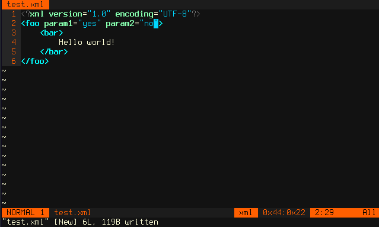
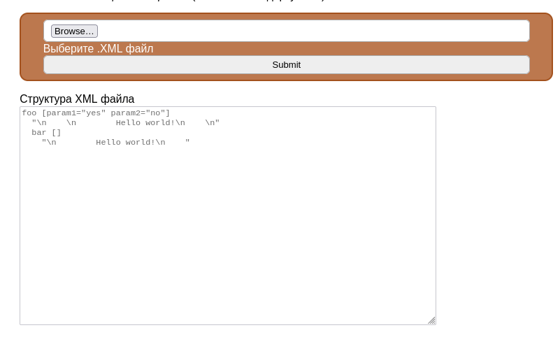
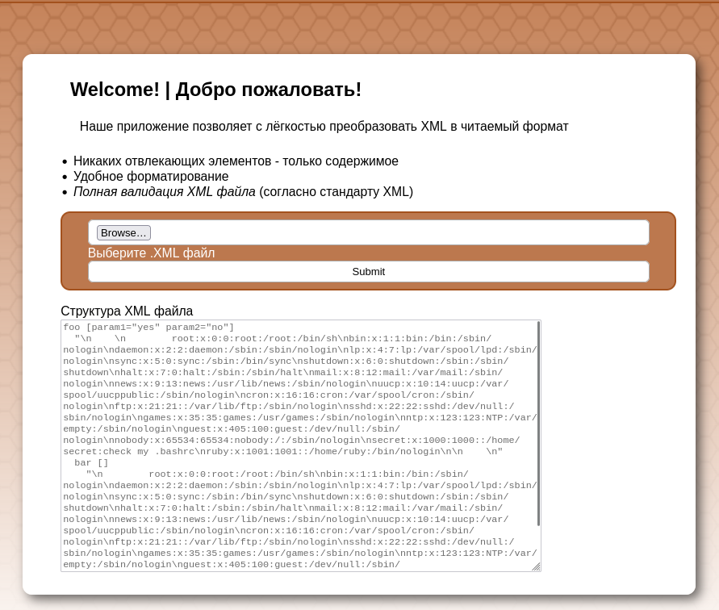
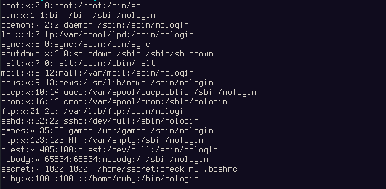
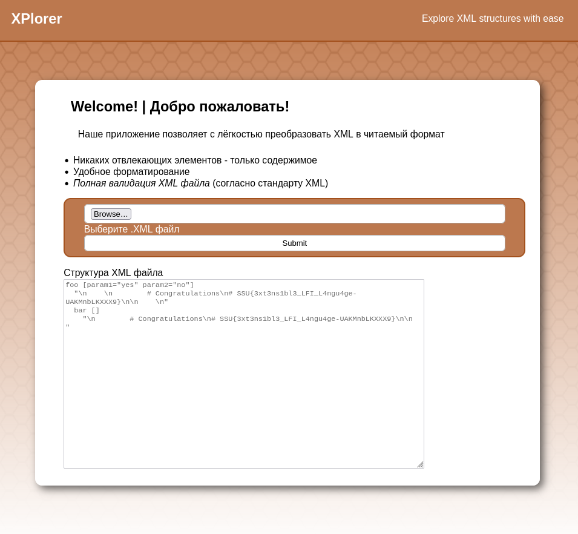

XPlore
----------------
1000

### Автор: unatcoman
### Решил: unatcoman

Описание:
```
Наши умельцы написали приложение для разбора XML файлов.

На этот раз ключ от админки надёжно спрятали - там было что-то про GECOS-поле и учётные записи.
```

Флаг: ``SSU{3xt3ns1bl3_LFI_L4ngu4ge-UAKMnbLKXXX9}``

### Решение:

1. Открываем страницу сайта


На странице видна форма для отправки XML файла. 

2. Попробуем создать XML файл и отправить на страницу





Сайт преобразует XML файл в человекочитаемый вид. Значит, как минимум, на сайте происходит обработка XML документа.
Это потенциально открывает такой класс атак, как XML External Entity (Внешние сущности XML).

Атака XML External Entity использует факт того, что в стандарте XML сущности могут ссылаться на внешние документы, которые должны быть подключены для обработки XML документа. В качестве пути к документу может указываться абсолютно любой URL, и в таком случае задачей парсера XML становится запрос по этому URL, получения документа и его обработка для подключения к текущему документу.

> Замечание: Несмотря на то, что это часть стандарта XML, в последнее время мало парсеров XML по умолчанию реализуют подключение внешних сущностей. Это связано в том числе с тем, что обеспечить безопасность в таком режиме становится очень трудно.

> Замечание 2: Так как XML формально перекладывает задачу обработки URL на парсер, нет строгого обозначения, какие схемы (протоколы) URL должны обрабатываться всеми парсерами, и в большинстве случаев работать будут только URL вида `file:///путь/к/файлу`. Однако, парсеры на основе libxml2 (это парсеры для большинства скриптовых языков - Python, Node.JS, Ruby, и т.д.) также *могут* поддерживать схемы `http://` и `ftp://`. Стандартный парсер XML для PHP, дополнительно ко всем схемам libxml2, также *может* поддерживать `gopher://`, `php-fpm://`, `expect://`, `php://`, `data://` и другие. Парсер Java тоже *может* поддерживать собственные схемы типа `jar:`

3. Создадим тестовый payload для эксплуатации XML External Entity и отправим его серверу на обработку. Для этого добавим в наш XML документ сущность `&test;`, ссылающуюся на URL `file:///etc/passwd`




Получили список пользователей из /etc/passwd. Среди них у пользователя `secret` есть запись в GECOS комментарии - `check my .bashrc`.



4. Используя тот же метод меняем URL внешней сущности на `file:///home/secret/.bashrc`. Отправляем запрос




Получен флаг

Ресурсы:

- https://book.hacktricks.wiki/en/pentesting-web/xxe-xee-xml-external-entity.html
- https://portswigger.net/web-security/xxe
