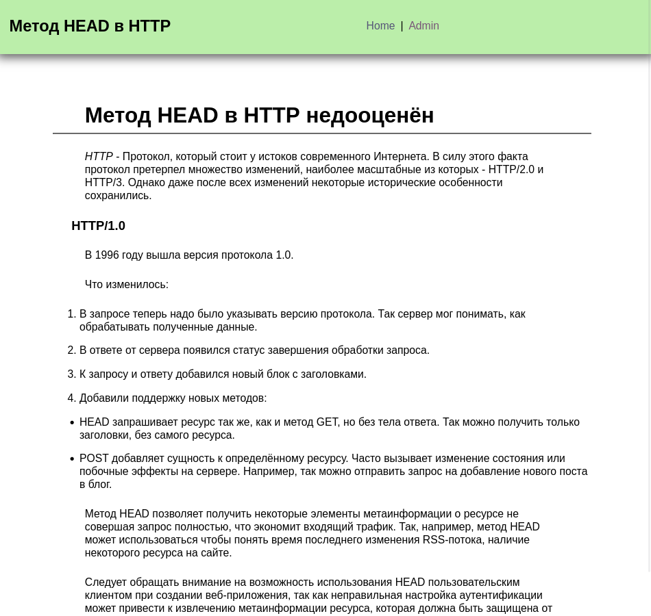
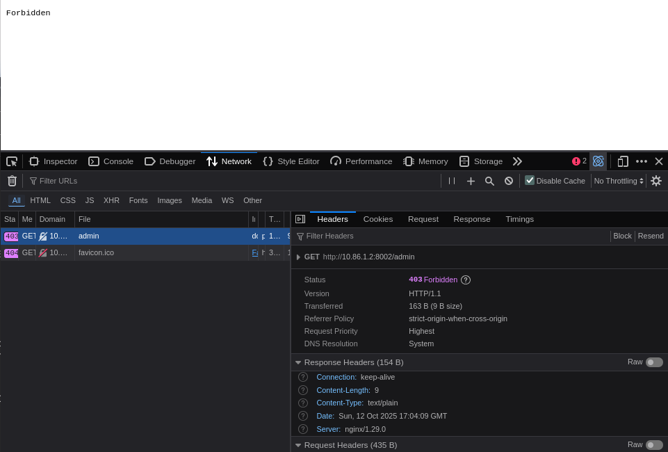
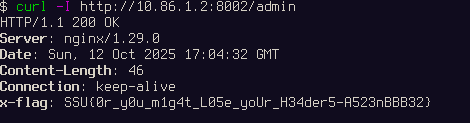

DontLoseYourHead
----------------
450

### Автор: unatcoman
### Решил: unatcoman

Описание:
```
Уроки истории (из жизни)
```

Флаг: `SSU{0r_y0u_m1g4t_L05e_yoUr_H34der5-A523nBBB32}`

### Решение:

1. Открываем страницу сайта



На странице видно краткое описание истории протокола HTTP, и, в частности, упоминается метод HEAD. В конце страницы также есть упоминание обхода авторизации методом HEAD. При попытке зайти в Admin выдаётся ошибка Forbidden



2. Используя curl, обращаемся к сайту методом HEAD (флаг `-I`)



Получаем флаг